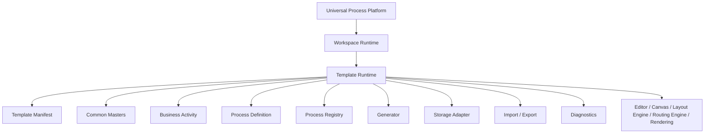
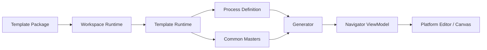
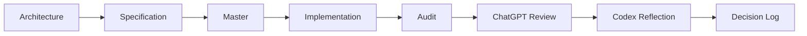

# Architecture

|Field|Value|
|---|---|
|Title|Universal Process Platform Architecture|
|Purpose|Universal Process Modeling Platform의 공식 아키텍처 기준을 정의한다.|
|Status|Draft|
|Owner|Project Team|
|Last Updated|2026-06-27|
|Related Docs|`Layer.md`, `DataModel.md`, `Generator.md`, `LocalDevelopment.md`, `TemplatePackage.md`, `LocalStorage.md`, `RoleBasedAccessControl.md`|

## Vision

이 프로젝트는 ERP Process Navigator가 아니라 Universal Process Modeling Platform이다.

목적은 두 가지다.

1. Universal Process Modeling Platform
   - 특정 회사에 종속되지 않는 범용 프로세스 모델링 플랫폼
   - ERP, SCM, 제조, 물류, 회계, 공공, 서비스 프로세스에 재사용 가능
   - Node, Edge, Lane, Zone, Canvas, Editor, Layout, Routing, Rendering, Diagnostics를 범용 구조로 유지

2. Copan ERP Operating Template
   - Universal Process Platform 위에서 동작하는 첫 번째 운영 Template
   - Copan의 Process, Masters, Lane, Zone, Business Type, Docs, Audit, Review, Sample은 Template Layer에 둔다
   - Copan은 Platform이 아니라 Template이다

## Architecture Principle

Platform은 특정 회사, 조직, ERP, 업무명을 알면 안 된다.

Copan 전용 값은 Template Runtime 또는 Template Package에만 존재해야 한다.

## Runtime Direction

현재 구현은 아직 기존 Process Data와 ReactFlow 렌더링 경로를 유지한다.

장기 목표는 Template Runtime이 Process Definition과 Masters를 해석하고, Generator가 ViewModel을 생성하며, Platform은 ViewModel을 편집/렌더링하는 구조다.

## Current Scope

현재 개발 범위는 다음으로 제한한다.

- Local Core Platform
- Local Template Package
- Local Storage Adapter
- Import / Export JSON
- Role Based Access Control 설계

## Out of Scope

현재 Architecture 범위에서 제외한다.

- Firebase
- AWS
- Hosting
- Authentication 구현
- Google Workspace Login
- Cloud Storage
- Cloud Database
- Deployment
- Multi User
- Collaboration

## Development Principle

향후 개발은 다음 순서로 진행한다.

Architecture를 먼저 변경하고, 그 다음 Specification, Master, Code를 변경한다.

코드가 Architecture와 다르면 코드를 즉시 고치지 않는다. 먼저 Architecture가 최신 기준인지 검토하고, Architecture 승인 후 코드 수정으로 내려간다.
