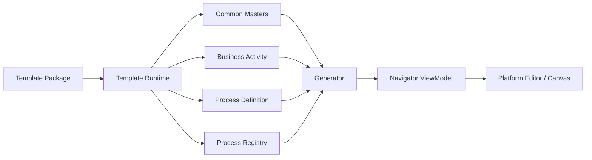
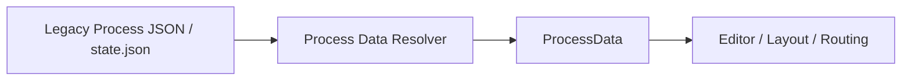

# Data Model

|Field|Value|
|---|---|
|Title|Data Model|
|Purpose|Platform Data, Workspace, Template Package, Process Definition, ViewModel의 관계를 정의한다.|
|Status|Approved|
|Owner|Project Team|
|Last Updated|2026-07-08|
|Related Docs|`Architecture.md`, `Layer.md`, `TemplatePackage.md`, `../02_Master/ProcessDefinition.md`, `../05_Review/Codex/Workflow-Phase1-Specification.md`, `../05_Review/Codex/Workflow-Phase2-Open-Issues-Decision.md`|

## Principle

Platform Data와 Template Data를 분리한다.

Platform은 데이터의 구조와 편집 동작을 다루고, Template은 업무 의미와 프로세스 내용을 가진다.

## Target Data Flow



## Current Compatibility Flow

기존 JSON은 유지한다.

현재 구조에서는 기존 Process Data를 Template Runtime의 process state로 해석한다.



장기적으로 다음 흐름으로 전환한다.


## Process Definition Rule

Process Definition에는 업무 흐름만 둔다.

포함:

- Sequence
- Branch
- Loop
- Condition
- Business Activity reference

포함하지 않음:

- 색상
- 크기
- x/y 좌표
- cellSlot
- route points
- ReactFlow rendering 정보

## Template Data Rule

Copan 전용 Process, Masters, Lane, Zone, System Mapping, Docs, Audit, Review, Sample은 Template Data다.

Template Data는 향후 Template Package로 export/import 가능해야 한다.

## Workflow Grouping Metadata

> Workflow/Variant 구조 설계 근거는 `../05_Review/Codex/Workflow-Phase1-Specification.md`와 `../05_Review/Codex/Workflow-Phase2-Open-Issues-Decision.md`를 따른다. 본 절은 그 결정(O3)을 Data Model 기준으로 확정한다.

### 정의와 위치 (O3)

`workflows[]`는 `commonMasters`에 속하지 않는 **payload 최상위 별도 배열**이며, 실행 기준정보 Master가 아니라 **프로세스 그룹핑 메타데이터(Workflow grouping metadata)** 로 정의한다.

따라서 `workflows[]`는 Methodology v1.0의 "새 Master 신설 금지" 원칙과 충돌하지 않는다. `schemaVersion`은 `2`를 유지한다.

- Workflow는 Node/Edge/Lane 같은 실행 데이터가 아니라, Process를 상위 흐름 단위로 묶는 **뷰·그룹핑 메타데이터**다.
- `workflows[]`가 없어도 Process는 그대로 동작한다(전체 Process가 카테고리 직속으로 표시되는 fallback). 이 선택적·파생적 성격이 필수 기준 데이터인 Master와 근본적으로 다르다.
- `commonMasters`(lanes/phases 등 정규 Master)에는 포함하지 않는다.

### 저장 구조 (설계 수준)

```text
payload {
  kind: 'copan-process-navigator-state'
  version: 2                     # 유지 — Workflow는 v2 내 additive
  commonMasters { lanes[], phases[], ... }   # workflows 미포함
  processes[]                    # ProcessInstance
  overviewProcessGroups[]
  detailProcessGroups[]
  workflows[]                    # ← 신규 최상위 별도 배열 (optional)
}

Workflow {
  workflowId    : string   (required, unique)
  workflowName  : string   (required)
  category      : string   (optional)   # 기존 lifecycleGroupId 값 재사용
  status        : string   (optional)   # 'active' | 'draft' | 'deprecated'
  steps         : string[] (optional)   # 표시용 단계 라벨 — 노드 미연결
  order         : number   (optional)
  # 확장 슬롯(Phase 2+ 선택): searchKeywords, aiKeywords, tags,
  #   relatedErpModules, requiredMasterData, requiredRoles, trigger,
  #   entryCondition, exitCondition, relatedWorkflowIds
}
```

### DetailProcessGroup 확장 필드 후보 (additive)

Variant 연결은 `DetailProcessGroup`에 optional 필드를 additive로 추가하는 방식을 1순위로 한다(그룹이 Process와 1:1이라 마이그레이션 최소).

```text
DetailProcessGroup {
  ...기존 필드,
  workflowId    : string  (optional)   # 소속 Workflow
  variantLabel  : string  (optional)   # 예: 'B2B 국내' — Phase 2 우선 관리 키
  variantId     : string  (optional)   # 정규 Variant 엔티티 도입 시 (Phase 2 이후 재평가)
  variantOrder  : number  (optional)
}
```

### 하위호환 원칙

- **additive만 허용한다.** 신규 필드·배열은 전부 optional이며, 미지정 시 v1.0-baseline 동작을 유지한다.
- 기존 `state.json`·Import·Export 파일은 완전 호환한다. `workflows[]`가 없는 payload는 fallback으로 정상 로드하며, 구버전 로더는 미지 필드를 무시한다.
- Process ID / Node ID / Group ID는 변경하지 않는다. Workflow/Variant 매핑은 이름이 아니라 **ID 기준**으로 관리한다.
- 재구성 경로(`normalizeProcessInstance`·`mergeMissingDetailProcesses` 등)에서 신규 필드가 유실되지 않도록 보존 회귀 테스트를 필수로 한다(`laneIds` 유실 선례 참조).
