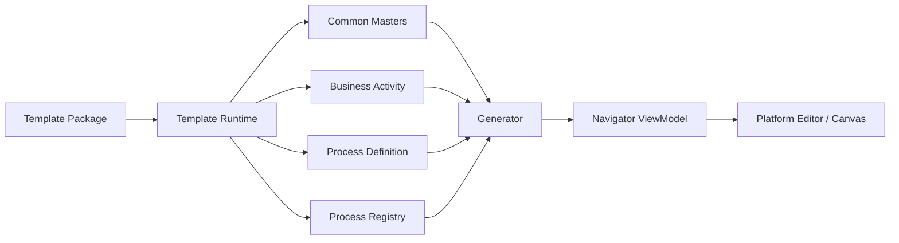
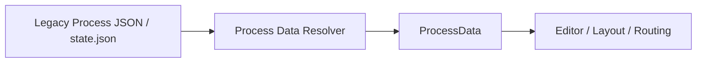
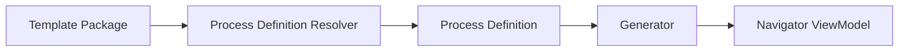

# Data Model

|Field|Value|
|---|---|
|Title|Data Model|
|Purpose|Platform Data, Workspace, Template Package, Process Definition, ViewModel의 관계를 정의한다.|
|Status|Draft|
|Owner|Project Team|
|Last Updated|2026-06-27|
|Related Docs|`Architecture.md`, `Layer.md`, `TemplatePackage.md`, `../02_Master/ProcessDefinition.md`|

## Principle

Platform Data와 Template Data를 분리한다.

Platform은 데이터의 구조와 편집 동작을 다루고, Template은 업무 의미와 프로세스 내용을 가진다.

## Target Data Flow

## Current Compatibility Flow

기존 JSON은 유지한다.

현재 구조에서는 기존 Process Data를 Template Runtime의 process state로 해석한다.

장기적으로 다음 흐름으로 전환한다.

## Process Definition Rule

Process Definition에는 업무 흐름만 둔다.

포함:

- Sequence
- Branch
- Loop
- Condition
- Business Activity reference

포함하지 않음:

- 색상
- 크기
- x/y 좌표
- cellSlot
- route points
- ReactFlow rendering 정보

## Template Data Rule

Copan 전용 Process, Masters, Lane, Zone, System Mapping, Docs, Audit, Review, Sample은 Template Data다.

Template Data는 향후 Template Package로 export/import 가능해야 한다.
