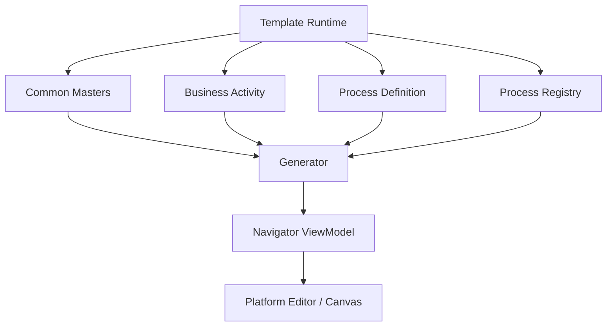

# Generator

|Field|Value|
|---|---|
|Title|Generator Architecture|
|Purpose|Template Runtime에서 Process Definition을 Platform ViewModel로 생성하는 Generator의 책임을 정의한다.|
|Status|Draft|
|Owner|Project Team|
|Last Updated|2026-06-27|
|Related Docs|`Architecture.md`, `DataModel.md`, `TemplatePackage.md`, `../02_Master/ProcessDefinition.md`|

## Role

Generator는 Template Runtime에 속한다.

Generator는 Template Package의 Common Masters, Business Activity, Process Definition, Process Registry를 해석해 Platform이 렌더링할 수 있는 Navigator ViewModel 또는 Process Instance를 생성한다.

## Responsibility

Generator의 책임:

- Process Definition 해석
- Business Activity를 Node 후보로 변환
- 조건, 분기, 반복 흐름을 Edge 후보로 변환
- Common Masters를 기준으로 node type, edge type, default system, default lane, default zone을 해석
- Layout Rule Master를 기준으로 초기 배치 힌트 생성
- Platform ViewModel 생성

Generator가 하지 않는 것:

- Canvas 렌더링
- 사용자의 편집 이벤트 처리
- 실제 edge path routing
- 특정 회사 로직을 Platform Core에 주입

## Current Status

현재 Generator는 Architecture 기준과 Interface 중심으로 정의한다.

자동 생성 로직은 별도 Phase에서 구현한다.

현재 구현은 기존 Process Data와 Layout/Router 경로를 유지한다.

## Target Flow

