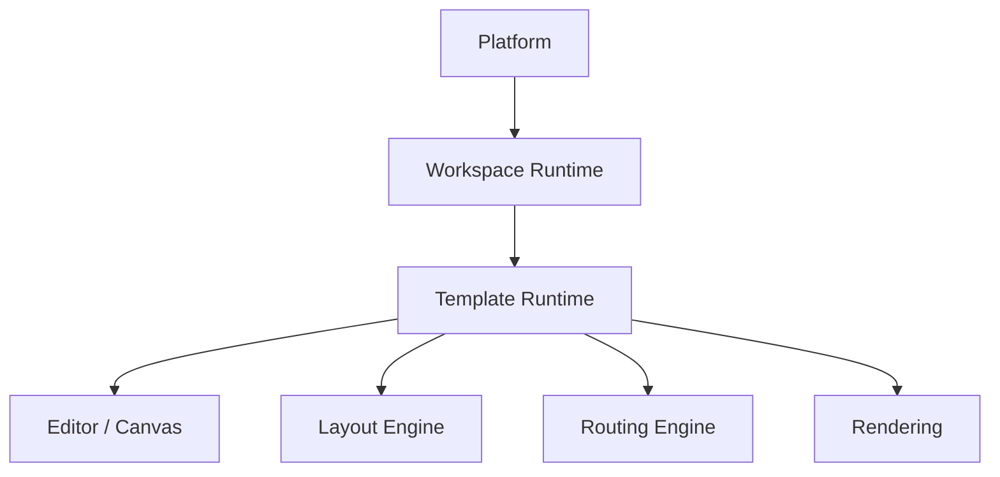

# Layer

|Field|Value|
|---|---|
|Title|Layer Architecture|
|Purpose|Platform, Workspace Runtime, Template Runtime, Editor/Engine 계층의 책임을 정의한다.|
|Status|Draft|
|Owner|Project Team|
|Last Updated|2026-06-27|
|Related Docs|`Architecture.md`, `DataModel.md`, `LocalStorage.md`, `TemplatePackage.md`|

## Layer Overview

## Platform

Platform은 범용 프로세스 모델링 기능을 제공한다.

Platform은 특정 회사, ERP, 조직, 업무명을 알면 안 된다.

포함:

- Node
- Edge
- Lane
- Zone
- Canvas
- Editor
- Layout Engine
- Routing Engine
- Diagnostics
- Import / Export Framework
- Property Panel
- Undo / Redo
- Clipboard
- Selection

## Workspace Runtime

Workspace Runtime은 하나의 프로젝트 공간을 관리한다.

예:

- Copan ERP
- Samsung SCM
- My Template
- Sample

Workspace는 현재 활성 Template을 관리한다.

Platform은 Workspace의 구체적인 이름이나 업무 의미를 알지 않는다.

## Template Runtime

Template Runtime은 Workspace 아래에서 현재 활성 Template을 실행한다.

관리 대상:

- Template Manifest
- Common Masters
- Business Activity
- Process Definition
- Process Registry
- Generator
- Storage Adapter
- Import
- Export
- Validation
- Diagnostics

Platform은 Template Runtime을 통해서만 Template 데이터에 접근한다.

## Storage Adapter

Storage Adapter는 Template Runtime의 일부다.

현재는 Local JSON 기반 adapter만 지원한다.

향후 확장 후보:

- Local File
- Browser File
- Template Package
- Cloud

Cloud 계층은 현재 Scope가 아니다.

## Copan Template

Copan은 Platform이 아니라 Template이다.

Copan에 존재하는 Process, Masters, Lane, Zone, Business Type, Docs, Audit, Review, Sample은 Template Layer에 존재해야 한다.

Platform에는 Copan 전용 값이 포함되면 안 된다.
