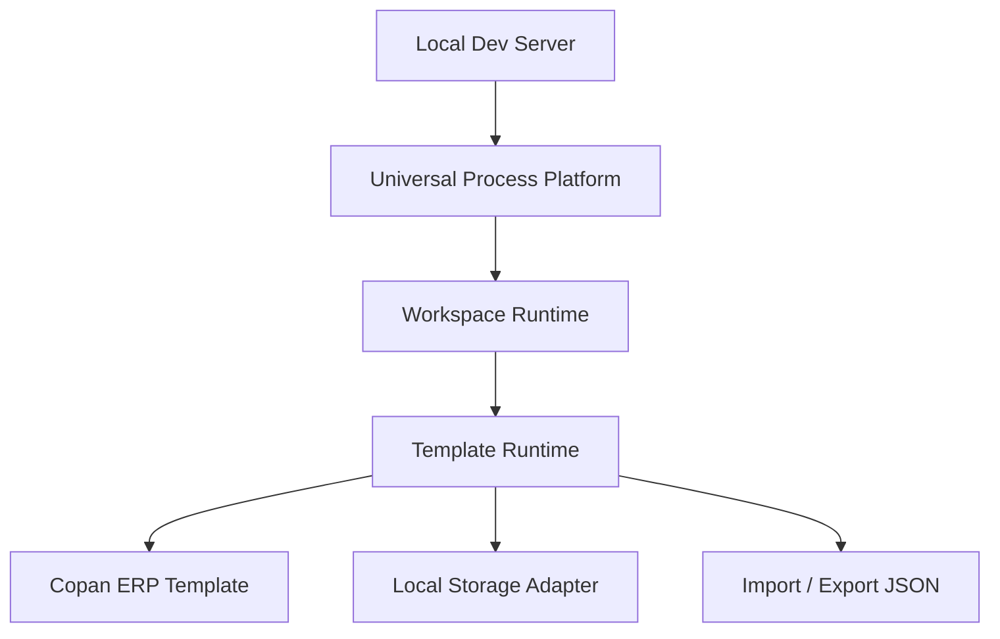

# Local Development Architecture

|Field|Value|
|---|---|
|Title|Local Development Architecture|
|Purpose|로컬 개발환경에서 Universal Process Platform과 Template Runtime을 분리하는 범위와 원칙을 정의한다.|
|Status|Draft|
|Owner|Project Team|
|Last Updated|2026-06-27|
|Related Docs|`Architecture.md`, `Layer.md`, `LocalStorage.md`, `TemplatePackage.md`|

## Scope

현재 범위는 배포/호스팅이 아니라 로컬 개발환경에서의 구조 분리다.

현재 개발 대상:

- Local Core Platform
- Local Workspace Runtime
- Local Template Runtime
- Local Template Package
- Local Storage Adapter
- Import / Export JSON

목표:

- Universal Process Platform 영역과 Copan Template 영역 분리
- Copan 전용 데이터/프로세스/문서/설정 분리
- Template import/export 가능한 구조 설계
- local storage 기준 저장/불러오기 안정화
- 향후 외부 호스팅 또는 서비스 서버 전환이 가능하도록 환경 의존성 제거

## Local Runtime

현재 앱은 local server 기준으로 개발/테스트한다.

## Out of Scope

현재 범위에서 제외한다.

- Firebase
- AWS
- Hosting
- Authentication
- Firestore
- Cloud Storage
- Cloud Database
- Google Workspace Login
- Deployment
- Multi User
- Collaboration

## Environment Boundary

Core Platform은 특정 저장소 구현에 의존하지 않는다.

허용:

- local JSON 기반 초기 데이터
- browser file import/export
- local server JSON save/load
- template package import/export

비허용:

- 특정 cloud provider SDK 직접 의존
- auth provider 직접 의존
- deployment target 기준 분기

## Local First Rule

현재는 local-first 기준으로만 검증한다.

Cloud 또는 hosting 전환 가능성은 고려하되, 현재 코드와 문서 기준에는 포함하지 않는다.
