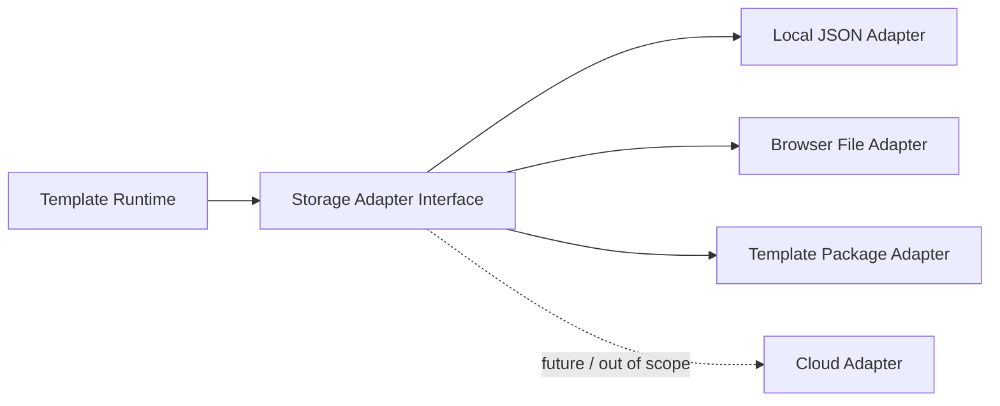

# Local Storage

|Field|Value|
|---|---|
|Title|Local Storage Architecture|
|Purpose|로컬 개발환경에서 Storage Adapter와 향후 저장소 전환 기준을 정의한다.|
|Status|Draft|
|Owner|Project Team|
|Last Updated|2026-06-27|
|Related Docs|`Architecture.md`, `Layer.md`, `LocalDevelopment.md`, `TemplatePackage.md`, `DataModel.md`|

## Principle

Storage Adapter는 Template Runtime의 일부다.

Core Platform은 저장 위치나 저장 방식에 직접 의존하지 않는다.

Platform은 Runtime을 통해 저장/불러오기 결과만 사용한다.

## Current Storage Scope

현재는 Local Storage Adapter만 지원한다.

현재 허용:

- `public/process-data/state.json` 초기 로드
- local server JSON save/load
- browser file import/export
- template package JSON import/export

현재 제외:

- Firebase
- Firestore
- Cloud Storage
- Auth
- server deployment
- multi-user collaboration

## Adapter Responsibility

Storage Adapter의 책임:

- active template load
- process state load
- process state save
- template import
- template export
- diagnostics metadata read/write

현재 구현 단계에서는 load/save 중심으로 시작한다.

Manifest, capabilities, package import/export는 Template Runtime 단계에서 확장한다.

## Target Adapter Direction

## Non Goals

이번 Scope에서 구현하지 않는다.

- Cloud 저장소 연동
- 로그인 기반 사용자별 저장
- 협업 동시 편집
- 배포 환경별 저장소 분기
