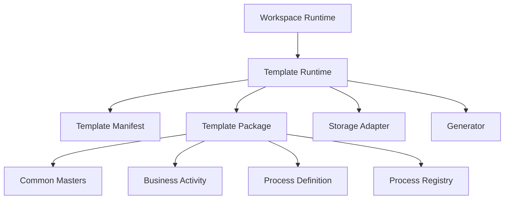

# Template Package

|Field|Value|
|---|---|
|Title|Template Package Architecture|
|Purpose|Template Runtime에서 실행 가능한 Template Package 구조를 정의한다.|
|Status|Draft|
|Owner|Project Team|
|Last Updated|2026-06-27|
|Related Docs|`Architecture.md`, `Layer.md`, `LocalDevelopment.md`, `LocalStorage.md`, `../02_Master/SystemMappingMaster.md`|

## Purpose

Template Package는 Universal Process Platform 위에서 실행되는 domain/client-specific process bundle이다.

Copan ERP Template은 Template Package의 첫 번째 실제 사례다.

Copan은 Platform이 아니라 Template이다.

## Package Contents

Template Package는 다음을 포함한다.

- Template Manifest
- Common Masters
- Business Activity
- Process Definition
- Process Registry
- process instances
- lane/zone/system mapping
- layout rules
- routing/display policies
- migration/mapping metadata
- template docs/audit/review
- optional source samples

Core source code는 포함하지 않는다.

## Manifest Example

```json
{
  "kind": "process-template-package",
  "templateId": "copan-erp-template",
  "displayName": "Copan ERP Template",
  "version": "0.1.0",
  "scope": "client-template",
  "runtime": "local",
  "entry": {
    "state": "process-data/state.json",
    "masters": "masters/commonMasters.json",
    "businessActivities": "business-activities",
    "processDefinitions": "process-definitions",
    "processRegistry": "registry/processRegistry.json",
    "layoutRules": "layout-rules",
    "policies": "policies"
  }
}
```

## Runtime Relationship



## Import / Export

Import:

- validate template manifest
- load masters
- load business activities
- load process definitions
- load process instances
- load template policies
- register active template in Workspace Runtime

Export:

- export active template manifest
- export current process state
- export masters and registries
- optionally include docs/audit/review/sample

## Local First

현재 Template Package는 local JSON package 기준으로 설계한다.

외부 호스팅, cloud storage, auth integration은 이번 범위가 아니다.
