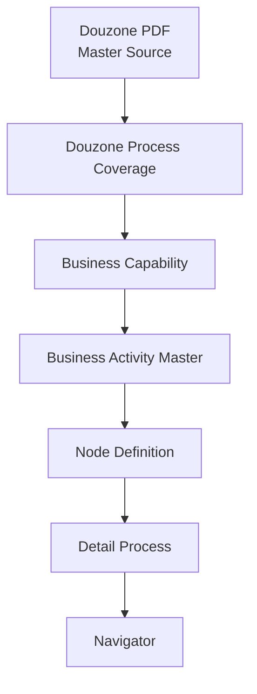
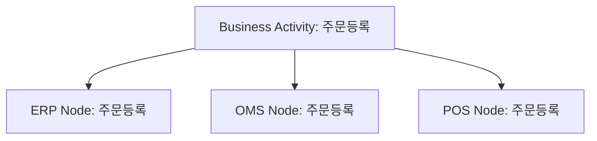
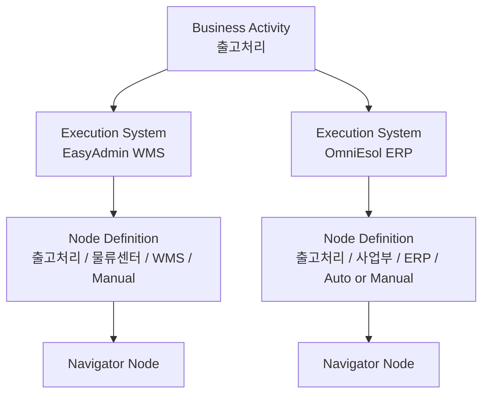

# Business Activity Master

|Field|Value|
|---|---|
|Title|Business Activity Master|
|Purpose|Business Capability 아래에서 반복 사용하는 현업 업무 Activity를 정의한다.|
|Status|Approved|
|Owner|Project Team|
|Last Updated|2026-06-29|
|Related Docs|`BusinessCapabilityMaster.md`, `BusinessActivity.md`, `NodeDefinitionStandard.md`, `NodeMaster.md`, `ProcessDefinition.md`, `../06_Data/02_Mapping/ProcessAuthoringStandard.md`|

> Methodology v1.0 Frozen. 변경은 Methodology Revision 결정이 있을 때만 수행한다.

## Purpose

Navigator는 장기적으로 Node를 관리하는 시스템이 아니라 업무 Capability와 Activity를 관리하는 시스템이다.

앞으로 Detail Process는 Node를 직접 나열하는 방식이 아니라 Business Activity를 조합하여 작성한다.

## Definition

Business Activity는 현업 업무 자체를 의미하며, 반드시 Business Capability 아래에 등록한다.

Node는 Business Activity를 특정 Execution System, 업무 책임 조직, 수행 영역, 처리 방식에 맞게 표현한 것이다.

예시:

이 경우 Business Activity는 하나이지만, Execution System이 다르면 Node Definition은 달라질 수 있다.

Execution System은 Work Center 기준으로 일괄 결정하지 않는다.

동일한 Work Center에서도 Activity에 따라 OmniEsol ERP, EasyAdmin OMS, EasyAdmin WMS, EasyChain, Cafe24, POS 등을 순차적으로 사용할 수 있다.

## Relationship

|layer|role|example|
|---|---|---|
|Business Activity|현업 업무 자체|주문등록|
|Node Definition|Activity를 특정 Execution System/Owner/Work Center/처리 방식으로 표현|주문등록 / OmniEsol ERP / 사업부 / Manual|
|Detail Process|Node Definition의 흐름 조합|주문등록 → 주문확정 → 출고요청|
|Navigator|화면에 표시되는 운영 산출물|B2C 주문 등록 ~ 출고 ~ 매출 전표|

## Activity Attributes

모든 Business Activity는 아래 항목을 가진다.

|attribute|meaning|
|---|---|
|Activity ID|Activity의 고유 ID|
|Business Activity|현업 업무명|
|Description|업무 설명|
|Owner|기본 업무 책임 조직 후보|
|Execution System 후보|Activity 기준으로 실행될 수 있는 시스템 후보|
|Processing Type|Manual, API, Auto 후보|
|Input|주요 입력|
|Output|주요 출력|
|Preceding Activity|대표 선행 Activity|
|Following Activity|대표 후행 Activity|
|Related ERP Menu|관련 더존/OmniEsol ERP 메뉴|
|Related Process|주로 등장하는 Detail Process|
|Note|작성/검토 시 주의사항|

## Business Activity Master Table

아래 표는 현재 Copan TO-BE Process에서 반복적으로 사용하는 Activity 초안이다.

|Activity ID|Business Activity|Description|Owner|Execution System 후보|Processing Type|Input|Output|Preceding Activity|Following Activity|Related ERP Menu|Related Process|Note|
|---|---|---|---|---|---|---|---|---|---|---|---|---|
|act-business-opportunity|사업기회확보|신규 사업기회 또는 판매 기회를 식별한다.|사업부|수작업|Manual|영업/기획 정보|사업기회|없음|사업참여검토||01, 18|서비스/제상품 공통 선행 Activity|
|act-business-review|사업참여검토|사업 참여 여부와 실행 가능성을 검토한다.|사업부|Groupware / OmniEsol ERP|Manual|사업기회|참여 여부|사업기회확보|계약등록 / 사업계약품의||01, 18|판단/승인 성격 구분 필요|
|act-contract-approval|사업계약품의|계약 체결을 위한 품의를 상신한다.|사업부|Groupware|Manual|계약 조건|품의 결과|사업참여검토|계약등록||01, 18|승인/반려 분기 필요|
|act-contract-register|계약등록|계약 정보를 ERP에 등록한다.|사업부|OmniEsol ERP|Manual|계약서/거래조건|계약 정보|사업계약품의|프로젝트등록|계약등록|01, 18||
|act-project-register|프로젝트등록|계약 또는 사업 실행 단위를 프로젝트로 생성한다.|사업부|OmniEsol ERP|Manual|계약 정보|프로젝트 정보|계약등록|구매요청 / 사업실행품의|프로젝트등록|01, 18||
|act-project-approval|사업실행품의|프로젝트 실행을 위한 품의를 진행한다.|사업부|Groupware|Manual|프로젝트 정보|품의 결과|프로젝트등록|구매요청||01||
|act-vendor-register|거래처등록|신규 또는 변경 거래처 정보를 등록한다.|사업부 / 상생협력팀|OmniEsol ERP|Manual|거래처 정보|거래처 Master|거래처확인|구매요청 / 계약등록|거래처등록|01|기준정보 Activity|
|act-item-register|품목등록|상품/제품/서비스 품목 정보를 등록한다.|상생협력팀 / 사업부|OmniEsol ERP|Manual|품목 정보|품목 Master|품목확인|구매요청|품목등록|01|기준정보 Activity|
|act-purchase-request|구매요청|프로젝트 또는 운영 단위 구매를 요청한다.|사업부|OmniEsol ERP|Manual|프로젝트/품목/수량|구매요청|프로젝트등록|구매발주|구매요청|01, 02, 03, 19||
|act-purchase-order|구매발주|구매요청 기준으로 공급사 발주를 등록한다.|상생협력팀|OmniEsol ERP|Manual|구매요청|발주 정보|구매요청|입고요청|발주등록|02, 03||
|act-po-approval|발주품의|발주 조건에 대한 품의를 진행한다.|상생협력팀|Groupware|Manual|발주 정보|품의 결과|구매발주|입고요청||02||
|act-inbound-request|입고요청|발주 또는 반품 입고 예정 정보를 전달한다.|상생협력팀 / 사업부|OmniEsol ERP / EasyAdmin WMS|Manual / API|발주/반품 정보|입고 요청|구매발주 / 반품등록|입고처리|입고요청|02, 03, 05, 09||
|act-inbound-process|입고처리|입고 대상 물품을 실제로 확인하고 처리한다.|물류센터|EasyAdmin WMS|Manual|입고 요청|입고 처리 결과|입고요청|입고확정||02, 03, 05, 09||
|act-inbound-confirm|입고확정|입고 수량과 상태를 확정한다.|물류센터|EasyAdmin WMS|Manual|입고 처리 결과|입고확정 정보|입고처리|재고인식(+)|입고확정|02, 03, 05, 09||
|act-inventory-increase|재고인식(+)|입고 또는 반품 결과를 ERP 재고 증가로 반영한다.|상생협력팀 / 사업부|OmniEsol ERP|Auto|입고확정 정보|ERP 재고 증가|입고확정|매입마감 / 반품마감|재고반영|02, 05, 09|Auto이므로 Owner 기준 검토 필요|
|act-inventory-decrease|재고인식(-)|출고 또는 이동 결과를 ERP 재고 감소로 반영한다.|사업부 / 리테일사업부|OmniEsol ERP|Auto|출고확정 정보|ERP 재고 감소|출고확정|매출마감조회 / 매출마감확정|재고반영|04, 07, 08, 10, 11, 12, 14|Auto이므로 재무 Lane으로 이동하지 않음|
|act-consignment-check|위탁여부 확인|자사재고와 위탁재고 처리 기준을 판단한다.|사업부 / 상생협력팀|OmniEsol ERP / System Rule|Manual / Auto|주문/입고/출고 정보|위탁 여부|구매요청 / 출고요청 / 반품요청|위탁재고 현황 조회 / 일반 흐름||02-17|시스템 판단이면 Auto, 사람이 확인하면 Manual|
|act-consignment-stock-status|위탁재고 현황 조회|위탁재고 현황을 조회한다.|사업부 / 상생협력팀|OmniEsol ERP|Manual|위탁 여부|위탁재고 현황|위탁여부 확인|입고/출고/정산 처리|재고조회|02-17||
|act-order-register|주문등록|주문 또는 수주 정보를 등록한다.|사업부|OmniEsol ERP / EasyAdmin OMS / POS|Manual / API|주문 정보|주문등록 정보|온라인주문접수 / 계약등록|주문확정|수주입력|04, 06, 07, 08, 12, 20|Execution System별 Node Definition 분리|
|act-online-order-receive|온라인주문접수|온라인몰에서 주문이 발생한다.|온라인몰 / 사업부|Cafe24|Manual / API|고객 주문|온라인 주문|없음|주문정보연동||07, 08, 09, 11|외부 주체와 Copan Owner 구분 필요|
|act-order-sync|주문정보연동|온라인몰 주문 정보를 OMS/WMS/ERP로 전달한다.|사업부|Cafe24 / EasyAdmin OMS|API|온라인 주문|주문 연동 정보|온라인주문접수|주문등록 / 주문확정||07, 08, 11||
|act-order-confirm|주문확정|주문 처리 가능 여부와 출고 대상을 확정한다.|사업부|OmniEsol ERP / EasyAdmin OMS|Manual|주문등록 정보|확정 주문|주문등록|출고요청|주문확정|04, 07, 08, 12, 20||
|act-shipment-request|출고요청|출고 대상과 수량을 물류센터 또는 WMS에 전달한다.|사업부|OmniEsol ERP / EasyAdmin OMS|Manual / API|확정 주문|출고 요청|주문확정 / 기타출고 요청|출고처리|출고요청|04, 06, 07, 08, 10, 11, 12, 14||
|act-shipment-process|출고처리|실제 출고 작업을 수행한다.|물류센터|EasyAdmin WMS|Manual|출고 요청|출고 처리 결과|출고요청|출고확정||04, 06, 07, 08, 10, 11, 12, 14||
|act-shipment-confirm|출고확정|출고 수량과 상태를 확정한다.|물류센터|EasyAdmin WMS|Manual|출고 처리 결과|출고확정 정보|출고처리|재고인식(-)|출고확정|04, 06, 07, 08, 10, 11, 12, 14||
|act-sales-closing-inquiry|매출마감조회|매출마감 대상과 금액을 조회한다.|사업부|OmniEsol ERP|Manual|출고/판매 정보|마감 대상|재고인식(-) / 판매정보연동|매출마감확정|매출마감조회|04, 07, 08, 12, 20||
|act-sales-closing-confirm|매출마감확정|매출 마감 대상과 금액을 확정한다.|사업부|OmniEsol ERP|Manual|마감 대상|매출마감 확정|매출마감조회|전표생성(미결)|매출마감확정|04, 07, 08, 12, 20||
|act-voucher-pending-create|전표생성(미결)|마감 결과에 따라 ERP가 전표를 미결 상태로 자동 생성한다.|직전 Business Activity Owner|OmniEsol ERP|Auto|마감 확정 정보|미결 전표|매출마감확정 / 매입마감확정 / 정산마감확정|전표조회승인|전표생성|02, 04, 05, 07-21|Auto Node. Owner는 Execution System이 아니라 직전 Business Activity Owner를 따른다. 일반 매출마감이면 사업부, 정산마감확정이면 재무관리팀일 수 있다|
|act-voucher-review-approve|전표조회승인|미결 전표를 검토하고 승인한다.|재무관리팀|OmniEsol ERP|Manual|미결 전표|승인 전표|전표생성(미결)|전기처리 / 회계반영|전표조회승인|02, 04, 05, 07-21||
|act-sales-posting|매출전기처리|승인된 매출 전표를 회계에 반영한다.|재무관리팀|OmniEsol ERP|Manual|승인 전표|회계 반영|전표조회승인|완료|매출전기처리|04, 07, 08, 12, 20||
|act-ap-closing-confirm|매입마감확정|입고 또는 매입 대상 금액을 확정한다.|상생협력팀|OmniEsol ERP|Manual|입고/매입 정보|매입마감 확정|재고인식(+)|전표생성(미결)|매입마감확정|02, 19||
|act-return-register|반품등록|고객 또는 거래처 반품 요청을 등록한다.|사업부|OmniEsol ERP / Cafe24 / EasyAdmin OMS|Manual / API|반품 요청|반품등록 정보|주문확정 / 온라인 반품요청|입고요청|반품등록|05, 09||
|act-return-inbound-confirm|반품입고확정|반품 물품의 입고 수량과 상태를 확정한다.|물류센터|EasyAdmin WMS|Manual|반품입고 처리 결과|반품입고 확정|반품입고처리|재고인식(+)|반품입고확정|05, 09||
|act-return-closing-confirm|반품마감확정|반품 매출 또는 정산 대상 금액을 확정한다.|사업부|OmniEsol ERP|Manual|반품입고/환불 정보|반품마감 확정|재고인식(+)|전표생성(미결)|반품마감확정|05, 09||
|act-prepayment-settlement|선수금 처리|예약판매 또는 선결제 금액을 선수금으로 관리한다.|재무관리팀 / 사업부|PG / OmniEsol ERP|Manual / API|PG 결제 정보|선수금 정보|예약판매 주문|출고/매출 반제|선수금관리|08|Owner는 실제 운영 책임 기준으로 확정 필요|
|act-prepayment-offset|선수금 반제|출고/매출 확정 후 선수금을 반제한다.|재무관리팀|OmniEsol ERP|Manual / Auto|선수금 정보 / 매출 정보|반제 처리|매출마감확정|전표조회승인|선수금반제|08||
|act-store-sale|매장판매|매장에서 POS 판매가 발생한다.|리테일사업부 / 판매현장|EasyChain / POS|Manual|고객 판매|POS 판매 정보|없음|판매정보연동||12, 13||
|act-pos-sales-sync|판매정보연동|POS/EasyChain 판매 정보를 ERP로 전달한다.|리테일사업부|EasyChain / POS / OmniEsol ERP|API|POS 판매 정보|ERP 판매 정보|매장판매|매출마감조회||12||
|act-stock-transfer-request|창고이동 요청|매장 또는 창고 간 재고이동을 요청한다.|리테일사업부 / 사업부|EasyChain / POS / OmniEsol ERP|Manual|이동 요청|재고이동 요청|재고 필요 판단|창고이동 확정|재고이동|13|판매현장 Work Center라도 Activity가 재고이동 요청이면 OmniEsol ERP일 수 있다|
|act-stock-transfer-confirm|창고이동 확정|재고이동 결과를 확정한다.|리테일사업부 / 물류센터|EasyChain / POS / EasyAdmin WMS|Manual|재고이동 요청|재고이동 확정|창고이동 요청|입/출고정보 저장|재고이동확정|13||
|act-stock-transfer-posting|입/출고정보 저장|재고이동 결과를 입/출고정보로 저장한다.|리테일사업부 / 사업부|OmniEsol ERP / Database|Auto|재고이동 확정|입/출고정보|창고이동 확정|재고인식(+/-)|입출고정보|13|Auto Node. Owner 확정 필요|
|act-other-issue-request|기타출고 요청|무상증정, 샘플, 기타 사유 출고를 요청한다.|사업부|OmniEsol ERP|Manual|출고 사유/수량|기타출고 요청|품의/요청|출고요청|기타출고|14||
|act-other-issue-confirm|기타출고 확정|기타출고 대상 물품을 출고 확정한다.|물류센터|EasyAdmin WMS|Manual|기타출고 요청|출고확정 정보|출고처리|재고인식(-)|기타출고확정|14||
|act-settlement-target-collect|정산대상 집계|정산 대상 매출, 비용, 계약 조건을 집계한다.|사업부|OmniEsol ERP|Manual|매출/계약/비용 정보|정산 대상|매출마감 / 계약조건|정산마감|정산대상집계|15-17, 21||
|act-royalty-settlement|로열티정산|기획사 또는 권리자 대상 로열티를 정산한다.|사업부 / 재무관리팀|OmniEsol ERP|Manual|매출/계약 조건|로열티 정산 결과|정산대상 집계|전표생성(미결)|로열티정산|15||
|act-consignment-settlement|위탁매출정산|위탁 매출과 수수료를 정산한다.|사업부 / 재무관리팀|OmniEsol ERP|Manual|위탁매출 정보|위탁정산 결과|정산대상 집계|전표생성(미결)|위탁매출정산|16||
|act-revenue-share-settlement|수익배분정산|수익배분 계약 기준으로 매출/비용을 배분한다.|사업부 / 재무관리팀|OmniEsol ERP|Manual|매출/비용/계약 조건|수익배분 정산 결과|정산대상 집계|전표생성(미결)|수익배분정산|17, 21||
|act-mg-deduction-check|MG 차감여부 판단|MG 차감 대상 여부를 판단한다.|사업부|OmniEsol ERP|Manual / Auto|정산 대상|MG 차감 여부|정산대상 집계|MG 상계 / 정산마감||15, 21||
|act-settlement-close|정산마감확정|정산 금액과 기준을 검증하고 확정한다.|재무관리팀|OmniEsol ERP|Manual|사업부 집계 정산 결과|정산마감 확정|정산 계산 / 예외사항 반영 / 검증|전표생성(미결)|정산마감|15-17, 21|정산 Process에서는 집계는 사업부, 마감확정/예외사항 반영/검증은 재무관리팀 기준|
|act-exception-handle|예외사항처리|수량, 금액, 계약 조건 불일치 등 예외를 처리한다.|업무 책임 조직|OmniEsol ERP / 수작업|Manual|예외 정보|예외 처리 결과|검증/대사|정상 흐름 복귀||공통|Owner는 예외 발생 업무 기준|
|act-linked-process|연결 프로세스|다른 Detail Process로 이동하는 참조 지점이다.|해당 업무 Owner|Navigator|Manual|연결 대상|상세 프로세스 참조|현재 프로세스|대상 프로세스||공통|Activity라기보다 Navigator 참조 패턴|

## Process Authoring Sequence

앞으로 Detail Process 작성은 아래 순서로 진행한다.

1. Douzone Master Source에서 기준 업무와 ERP Menu를 확인한다.
2. Copan 운영 방식으로 필요한 Business Activity를 선정한다.
3. Business Activity Master에 존재하는지 확인한다.
4. 없으면 Business Activity Master에 새 Activity를 추가한다.
5. Activity별 Execution System 후보, Owner, Work Center, Processing Type을 확인한다.
6. Activity를 특정 Process 상황에 맞는 Node Definition으로 변환한다.
7. Node Definition을 Detail Process에 배치한다.
8. Navigator 화면에서 Lane, Node, Edge, Description을 검토한다.

## Relationship With Node Definition

Node Definition은 Business Activity를 Execution System, Owner, Work Center, Processing Type에 맞게 구체화한 것이다.

Business Activity는 시스템에 종속되지 않는다.

Execution System은 Work Center에 종속되지 않는다.

Node Definition은 Activity를 Execution System, Owner, Work Center, Processing Type, ERP Menu, Description 기준으로 구체화한다.

## Relationship With Node Master

Node Master는 Node Type, 기본 스타일, 기본 표현 방식을 관리한다.

Business Activity Master는 업무의 의미를 관리한다.

|master|responsibility|
|---|---|
|Business Activity Master|현업 업무 의미와 흐름 기준|
|Node Definition Standard|Activity를 특정 시스템/Owner/처리 방식으로 구체화하는 기준|
|Node Master|Node Type, 색상, 화면 표현 기준|

Node Type은 Activity를 대체하지 않는다.

예를 들어 `주문등록` Activity는 ERP Node, OMS Node, POS Node로 각각 표현될 수 있다.

## Governance

새 Node를 만들기 전에는 반드시 아래를 확인한다.

1. 동일한 Business Activity가 이미 Master에 있는가
2. 같은 Activity지만 Execution System만 다른 상황인가
3. Execution System을 Work Center 기준으로 일괄 추정하지 않았는가
4. Owner가 Lane 기준과 일치하는가
5. Processing Type이 Auto인데 Lane이 시스템 기준으로 잘못 바뀌지 않았는가
6. ERP Menu를 추적해야 하는 업무인가

Business Activity가 없다면 새 Activity를 추가한다.

Business Activity가 있다면 새 Activity를 만들지 않고 Node Definition만 추가한다.
