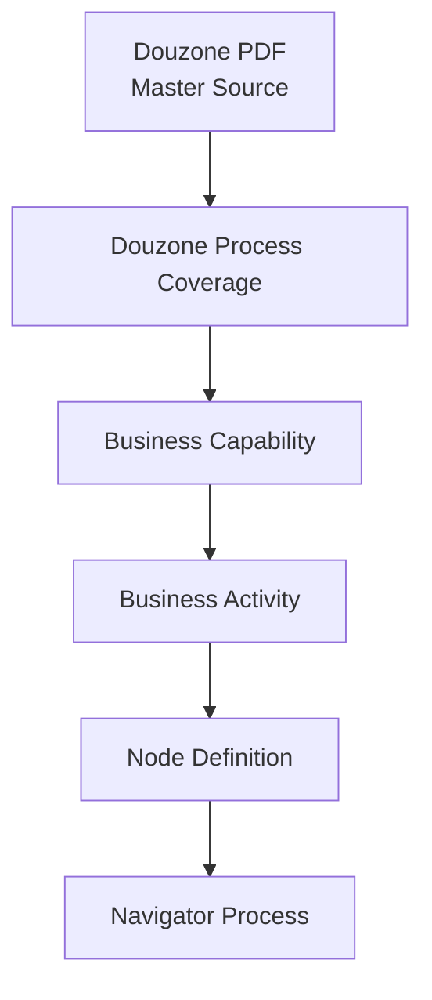
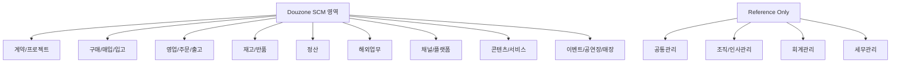

# Business Capability Master

|Field|Value|
|---|---|
|Title|Business Capability Master|
|Purpose|Douzone SCM 영역을 Business Capability 기준으로 정의하고 Business Activity를 하위에 매핑한다.|
|Status|Approved|
|Owner|Project Team|
|Last Updated|2026-06-29|
|Related Docs|`BusinessActivityMaster.md`, `NodeDefinitionStandard.md`, `ProcessDefinition.md`, `../06_Data/02_Mapping/ProcessMapping.md`, `../06_Data/01_Source/Douzone/README.md`|

> Methodology v1.0 Frozen. 변경은 Methodology Revision 결정이 있을 때만 수행한다.

## Purpose

Navigator의 구축 범위는 Douzone SCM 영역이다.

Navigator는 SCM 업무 담당자가 업무, 프로세스, ERP 메뉴를 이해하도록 지원하는 SCM Process Asset Repository다.

Douzone PDF는 이미 Master Source이므로 별도의 Douzone Process Master를 만들지 않는다.

Douzone SCM Process의 반영 범위는 `../06_Data/02_Mapping/DouzoneProcessCoverage.md`에서 관리한다.

따라서 Master 계층은 아래 순서를 따른다.

Business Capability는 Douzone SCM 업무 영역을 묶는 상위 분류다.

Business Activity는 반드시 하나 이상의 Capability 아래에 등록한다.

## Definition

Business Capability는 회사가 수행해야 하는 업무 능력 또는 업무 영역이다.

Capability는 특정 화면, 특정 시스템, 특정 조직에 종속되지 않는다.

예:

- 기준정보관리
- 구매관리
- 영업관리
- 재고관리
- 정산관리
- 해외업무
- 플랫폼
- 콘텐츠
- 이벤트
- 매장

## Capability Attributes

|attribute|meaning|
|---|---|
|Capability ID|Capability 고유 ID|
|Capability|업무 영역명|
|Description|업무 영역 설명|
|Douzone Source Area|Douzone TO-BE PDF 기준 관련 영역|
|Representative Activities|대표 Business Activity|
|Related Navigator Processes|현재 Navigator 관련 Process|
|Coverage|Navigator 반영 수준|
|Notes|검토/확장 시 주의사항|

## Business Capability Tree

## Capability Master Table

|Capability ID|Capability|Description|Douzone Source Area|Representative Activities|Related Navigator Processes|Coverage|Notes|
|---|---|---|---|---|---|---|---|
|cap-master-data-management|기준정보관리|거래처, 품목, 창고, 프로젝트 등 SCM 업무 기준정보를 관리한다.|품목 등록 PROCESS, 거래처 등록 PROCESS, 계약 등록 PROCESS|거래처등록, 품목등록, 계약등록, 프로젝트등록|01, 18|Medium|SCM 선행 Process에는 반영되어 있으나 기준정보 전용 Process 여부는 후속 검토 필요|
|cap-contract-project-management|계약/프로젝트관리|계약, 프로젝트, 사업 실행 기준을 관리한다.|계약 등록 PROCESS, 프로젝트/계약 관련 영역|사업기회확보, 사업계약품의, 계약등록, 프로젝트등록, 사업실행품의|01, 18, 21|Medium|서비스/정산까지 확장 필요|
|cap-procurement-management|구매관리|구매요청, 발주, 구매입고 전 선행 업무를 관리한다.|구매 입고 PROCESS|구매요청, 구매발주, 발주품의|01, 02, 03, 19|High|SCM 구매 흐름 중심으로 반영됨|
|cap-inbound-ap-management|매입/입고관리|입고, 매입마감, 매입전표 생성을 관리한다.|구매 입고 PROCESS|입고요청, 입고처리, 입고확정, 매입마감확정, 전표생성(미결)|02, 03, 19|High|Copan WMS/EasyAdmin 해석 포함|
|cap-sales-order-management|영업/주문관리|주문, 수주, 주문확정, 채널 주문 연동을 관리한다.|B2C 판매 PROCESS, B2B 판매 PROCESS, 플랫폼/콘텐츠 비재고 매출 PROCESS|온라인주문접수, 주문정보연동, 주문등록, 주문확정|04, 06, 07, 08, 12, 20|High|B2B/B2C/서비스 주문 흐름 반영|
|cap-shipment-management|출고관리|출고요청, 출고처리, 출고확정 업무를 관리한다.|B2C 판매 PROCESS, B2B 판매 PROCESS, 매장 출고 PROCESS, 기타 출고 PROCESS|출고요청, 출고처리, 출고확정|04, 06, 07, 08, 10, 11, 12, 14|High|EasyAdmin WMS 기반 Copan 해석 포함|
|cap-inventory-management|재고관리|재고 증가/감소, 위탁재고, 재고이동, 입출고정보를 관리한다.|재고이동 PROCESS, 매장 재고이동 PROCESS, 구매/판매/반품 관련 재고 흐름|재고인식(+), 재고인식(-), 위탁재고 현황 조회, 창고이동 요청, 창고이동 확정, 입/출고정보 저장|02-14|High|Auto Node Owner 기준 재정리가 필요|
|cap-return-management|반품관리|판매 반품, 반품 입고, 반품마감, 반품전표를 관리한다.|B2C 판매 반품 PROCESS, B2B 판매 반품 PROCESS|반품등록, 반품입고확정, 반품마감확정, 재고인식(+)|05, 09|High|B2B/B2C 반품 모두 Navigator에 존재|
|cap-settlement-management|정산관리|로열티, 위탁, 수익배분, 프로젝트 정산을 관리한다.|위탁 매출 정산 PROCESS, 판매 로열티 정산 PROCESS|정산대상 집계, 로열티정산, 위탁매출정산, 수익배분정산, MG 차감여부 판단, 정산마감|15, 16, 17, 21|Medium|Process는 있으나 현업 검토 수준 보강 필요|
|cap-overseas-business|해외업무|수출, B/L, 포워딩, 해외 B2B 업무를 관리한다.|자사 재고 해외 B2B PROCESS, 위탁 재고 해외 B2B PROCESS|수출이동지시, B/L 기준 출고, 포워딩, 매출전기처리|06|Medium|06 Process 중심. 무역/정산 세부 보강 필요|
|cap-platform-channel|플랫폼|온라인몰, Cafe24, 플랫폼 비재고 매출, 주문 연동을 관리한다.|B2C 판매 PROCESS, 플랫폼 비재고 매출 PROCESS|온라인주문접수, 주문정보연동, 주문등록, 주문확정|07, 08, 09, 11, 20|Medium|Cafe24 중심 반영. 플랫폼 비재고는 서비스 Process 보강 필요|
|cap-content-service|콘텐츠/서비스|콘텐츠 비재고 매출, 서비스 비용/매출/정산을 관리한다.|콘텐츠 비재고 매출 PROCESS, 비용청구관리|서비스 주문등록, 비용전표 생성, 서비스 매출마감, 프로젝트 정산|18, 19, 20, 21|Medium|서비스 Process 18-21은 존재하나 상세 검토 필요|
|cap-event-operation|이벤트|이벤트 주문, 당첨자, 현장수령/택배발송, 이벤트 출고를 관리한다.|이벤트 PROCESS|온라인주문접수, 당첨자 여부 확인, 현장수령 분리, 출고요청, 출고확정|11|Medium|Copan 운영 해석 반영 필요성이 큼|
|cap-popup-concert-operation|공연장/팝업|공연장/팝업 현장판매, 출고, 잔여재고 복귀를 관리한다.|공연장(행사장) 팝업 PROCESS|공연장 출고, 현장판매, 잔여재고 복귀, 매출마감|10|Medium|현장 운영 기준 보강 필요|
|cap-store-pos-management|매장/POS|매장 판매, POS, EasyChain, 매장 재고이동을 관리한다.|매장 출고 PROCESS, 매장 재고이동 PROCESS|매장판매, 판매정보연동, 창고이동 요청, 창고이동 확정|12, 13|Medium|매장/POS Owner 기준 정리 필요|

## Reference Only Capability

아래 Capability는 Navigator 구축 대상이 아니다. SCM Process와 연결되는 ERP 메뉴, 승인 지점, 교육 필요 사항만 Reference Only로 관리한다.

|Capability|Treatment|Reason|
|---|---|---|
|공통관리|Reference Only|공통코드/환경설정은 OmniEsol ERP 교육과 실제 사용으로 정착한다.|
|조직관리|Reference Only|조직/권한은 Navigator Lane/Owner 참조로만 관리한다.|
|인사관리|Reference Only|SCM Process Asset 구축 범위가 아니다.|
|회계관리|Reference Only|전표생성/전표조회승인 등 SCM 연결 지점은 표시하되 회계 프로세스 자체는 ERP 사용 기준으로 운영한다.|
|세무관리|Reference Only|부가세/세금계산서/신고는 Navigator 구축 대상이 아니며 ERP 교육 범위로 관리한다.|

## Business Activity Mapping

아래 표는 현재 `BusinessActivityMaster.md`의 주요 Activity를 Capability에 매핑한 초안이다.

|Capability|Business Activities|
|---|---|
|기준정보관리|거래처등록, 품목등록, 계약등록, 프로젝트등록|
|계약/프로젝트관리|사업기회확보, 사업참여검토, 사업계약품의, 계약등록, 프로젝트등록, 사업실행품의|
|구매관리|구매요청, 구매발주, 발주품의|
|매입/입고관리|입고요청, 입고처리, 입고확정, 매입마감확정, 전표생성(미결)|
|영업/주문관리|온라인주문접수, 주문정보연동, 주문등록, 주문확정|
|출고관리|출고요청, 출고처리, 출고확정|
|재고관리|재고인식(+), 재고인식(-), 위탁여부 확인, 위탁재고 현황 조회, 창고이동 요청, 창고이동 확정, 입/출고정보 저장|
|반품관리|반품등록, 반품입고확정, 반품마감확정|
|정산관리|정산대상 집계, 로열티정산, 위탁매출정산, 수익배분정산, MG 차감여부 판단, 정산마감|
|해외업무|수출이동지시, B/L 기준 출고, 포워딩, 해외 B2B 매출처리|
|플랫폼|온라인주문접수, 주문정보연동, 플랫폼 비재고 주문등록, 서비스 매출마감|
|콘텐츠/서비스|서비스 주문등록, 비용전표 생성, 서비스 매출마감, 프로젝트 정산|
|이벤트|이벤트 주문접수, 당첨자 여부 확인, 현장수령 분리, 택배발송 분리|
|공연장/팝업|공연장 출고, 현장판매, 잔여재고 복귀, 팝업 매출마감|
|매장/POS|매장판매, 판매정보연동, 매장 재고이동 요청, 매장 재고이동 확정|

## Current Navigator Coverage

현재 Navigator의 21개 Detail Process는 Douzone SCM 영역을 우선 커버한다.

|Coverage Level|Capabilities|Current State|
|---|---|---|
|High|구매관리, 매입/입고관리, 영업/주문관리, 출고관리, 재고관리, 반품관리|SCM TO-BE 01-14 중심으로 Navigator에 존재한다.|
|Medium|기준정보관리, 계약/프로젝트관리, 정산관리, 해외업무, 플랫폼, 콘텐츠/서비스, 이벤트, 공연장/팝업, 매장/POS|Process는 존재하지만 Douzone SCM 기준으로 상세 검토와 Activity 보강이 필요하다.|
|Reference Only|공통관리, 조직관리, 인사관리, 회계관리, 세무관리|Navigator 구축 대상이 아니며 OmniEsol ERP 교육과 실제 사용으로 정착한다.|

## Governance

앞으로 새로운 Business Activity를 추가할 때는 반드시 아래 순서를 따른다.

1. Douzone PDF Master Source와 `DouzoneProcessCoverage.md`에서 관련 업무 영역을 확인한다.
2. 기존 Business Capability에 포함되는지 확인한다.
3. 없으면 Business Capability Master에 새 Capability를 추가한다.
4. Capability 아래에 Business Activity를 등록한다.
5. Business Activity를 Node Definition으로 구체화한다.
6. Detail Process에 배치한다.

Business Activity는 Capability에 종속된다.

Node Definition은 Business Activity를 실행 시스템, Owner, Processing Type, ERP Menu, Description으로 구체화한다.

Navigator Process는 Node Definition의 흐름을 화면화한 결과물이다.

## Next Work

1. `DouzoneProcessCoverage.md`의 Douzone Process Coverage Matrix를 지속 보강한다.
2. Capability별 Douzone Source Page를 보강한다.
3. `BusinessActivityMaster.md`에 Capability ID 컬럼을 추가한다.
4. 현재 21개 Detail Process의 Node를 Capability/Activity 기준으로 재분류한다.
5. Reference Only Capability가 SCM Process와 만나는 ERP 메뉴/승인 지점만 문서로 관리한다.
