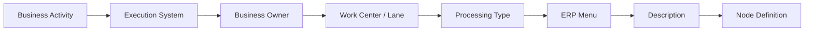
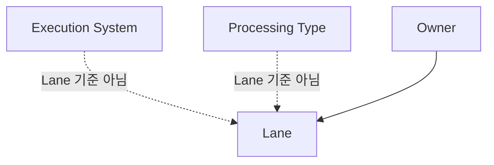

# Node Definition Standard

|Field|Value|
|---|---|
|Title|Node Definition Standard|
|Purpose|Navigator Node를 Business Activity, Owner, Execution System, Processing Type, ERP Menu, Description 기준으로 정의한다.|
|Status|Approved|
|Owner|Project Team|
|Last Updated|2026-07-02|
|Related Docs|`BusinessActivityMaster.md`, `NodeMaster.md`, `BusinessActivity.md`, `SystemMappingMaster.md`, `../06_Data/02_Mapping/ProcessAuthoringStandard.md`|

> Methodology v1.0 Frozen. 변경은 Methodology Revision 결정이 있을 때만 수행한다.

## Purpose

이 문서는 Copan ERP TO-BE Navigator에서 사용하는 Node의 정의 기준이다.

앞으로 모든 Detail Process는 Node를 작성할 때 이 문서를 참조한다.

Node Definition은 `BusinessActivityMaster.md`의 Business Activity를 특정 Execution System, Owner, Work Center, Processing Type 기준으로 구체화한 것이다.

Node는 단순한 도형이나 Lane 배치 결과가 아니다.

Node는 아래 6개 속성을 가진 업무 정의 단위이다.

## Required Attributes

|attribute|meaning|required|note|
|---|---|---|---|
|Business Activity|현업 업무명|Yes|Node Name의 기준이다.|
|Owner|업무 책임 조직|Yes|Lane 결정 기준이다.|
|Execution System|업무가 실행되는 시스템|Yes|Node 하단 System 정보의 기준이다.|
|Work Center|업무 수행 조직 또는 수행 영역|Conditional|현재 Navigator에서는 Lane/Owner와 함께 해석한다. Execution System 결정값으로 사용하지 않는다.|
|Processing Type|처리 방식|Yes|Manual, API, Auto 중 하나를 우선 사용한다.|
|ERP Menu|더존/OmniEsol ERP 메뉴명|Conditional|ERP 메뉴 추적이 필요한 경우 필수다.|
|Description|업무 설명|Yes|현업 검토자가 업무 의미를 이해할 수 있어야 한다.|

## Core Principle

Execution System은 Business Activity 기준으로 결정한다.

Work Center마다 고정된 Execution System이 있다고 가정하지 않는다.

Lane은 Owner를 표현한다.

Execution System은 Lane을 결정하지 않는다.

Processing Type도 Lane을 결정하지 않는다.

## Execution System by Activity

동일한 Work Center에서도 Business Activity에 따라 Execution System은 달라질 수 있다.

|Work Center|Business Activity|Execution System|Processing Type|
|---|---|---|---|
|판매현장|재고이동 요청|OmniEsol ERP|Manual|
|판매현장|출고 처리|EasyAdmin WMS|Manual / Auto|
|판매현장|현장 판매|EasyChain|Manual|
|판매현장|매출마감|OmniEsol ERP|Manual|
|온라인 운영|주문접수|Cafe24|Manual / API|
|온라인 운영|주문수집|EasyAdmin OMS|API|
|온라인 운영|출고|EasyAdmin WMS|Manual / API|
|온라인 운영|매출마감|OmniEsol ERP|Manual|

따라서 Node Definition 검증 시 Work Center 기준으로 Execution System을 일괄 추정하지 않는다. 반드시 Activity별 Execution System을 확인한다.

## Node Separation Rule

같은 Business Activity라도 Execution System이 다르면 다른 Node로 정의한다.

|Business Activity|Execution System|Owner|Processing Type|definition|
|---|---|---|---|---|
|출고처리|EasyAdmin WMS|물류센터|Manual|물류센터가 WMS에서 실제 출고를 처리한다.|
|출고처리|OmniEsol ERP|사업부 또는 재무관리팀|Manual / Auto|ERP 재고 또는 회계 반영을 처리한다.|

업무명이 같다는 이유로 두 Node를 합치지 않는다.

## Auto Node Rule

자동 생성 Node는 Execution System과 Owner를 반드시 구분한다.

Auto Node의 Owner는 Execution System이 아니라 자동 처리를 발생시킨 직전 Business Activity의 Owner를 따른다.

Execution System은 "어디에서 수행되는가"이고, Owner는 "누가 책임지는 업무인가"이다.

### 사업부 업무에서 발생한 Auto

|attribute|value|
|---|---|
|Business Activity|전표생성(미결)|
|직전 Business Activity|매출마감확정|
|직전 Activity Owner|사업부|
|Owner|사업부|
|Execution System|OmniEsol ERP|
|Processing Type|Auto|
|ERP Menu|전표생성|
|Description|사업부 매출마감확정 후 ERP가 전표를 미결 상태로 자동 생성한다. 재무관리팀 업무는 전표조회승인부터 시작한다.|

`전표생성(미결)`, ERP 자동 재고반영, ERP 자동 상태변경은 Execution System이 ERP라는 이유만으로 재무관리팀 Node가 되지 않는다.

### 재무 업무에서 발생한 Auto

|attribute|value|
|---|---|
|Business Activity|정산전표 생성(미결)|
|직전 Business Activity|정산마감확정 / 예외사항 반영 / 검증|
|직전 Activity Owner|재무관리팀|
|Owner|재무관리팀|
|Execution System|OmniEsol ERP|
|Processing Type|Auto|
|ERP Menu|전표생성|
|Description|재무관리팀의 정산 마감확정 결과로 ERP가 정산전표를 미결 상태로 자동 생성한다.|

정산 Process에서는 집계는 사업부, 마감확정/예외사항 반영/검증은 재무관리팀, 자동 전표생성은 직전 재무 마감확정의 Owner를 따라 재무관리팀으로 정의한다.

이 Rule은 전표생성, 재고반영, 상태변경, API 처리, 자동 인터페이스, 자동 정산, 자동 승인에 동일하게 적용한다.

## Processing Type

|type|meaning|lane decision|
|---|---|---|
|Manual|사람이 직접 입력, 확인, 판단, 승인하는 업무|Owner 기준|
|API|시스템 간 데이터 전달 또는 연동|연동 책임 Owner 기준|
|Auto|시스템이 자동 생성하거나 자동 상태 변경하는 업무|자동 처리의 업무 책임 Owner 기준|

`System`이라는 표현은 가능하면 Processing Type으로 사용하지 않는다.

시스템 자체는 Execution System으로 표현한다.

## Node Number Display Rule

Node Number는 Node Definition의 원천 속성이 아니다.

Navigator 화면에서 표시되는 원형 번호는 JSON 저장값이 아니라 렌더링 시 현재 Flow Execution Order를 기준으로 계산되는 view-only 값이다.

기존 `stepBadge`는 legacy field로 보존하지만, 신규 Process 작성, Audit, Review의 기준으로 사용하지 않는다.

Node Number는 Builder와 Viewer가 흐름을 빠르게 이해하도록 돕는 보조정보이며, Process의 원천 데이터나 승인 기준이 아니다.

### Numbered Node

아래 Node는 Flow Execution Order 기준 자동 번호 표시 대상이다.

|target|rule|
|---|---|
|Manual 업무 Node|사람이 직접 입력, 확인, 판단, 승인하는 실제 업무 Node는 번호를 표시한다.|
|ERP / OMS / WMS / POS 업무 Node|OmniEsol ERP, EasyAdmin OMS/WMS, EasyChain/POS 등에서 사람이 등록, 확인, 확정하는 업무 Node는 번호를 표시한다.|
|Approval / Decision Node|업무 의사결정, 품의, 승인/반려, Y/N 판단 등 현업 판단 성격의 Node는 번호를 표시한다.|

### Non-numbered Node

아래 Node는 Flow traversal에는 포함될 수 있지만 번호를 표시하지 않는다.

|target|reason|
|---|---|
|database|업무 Activity가 아니라 데이터 상태 또는 저장소를 표현한다.|
|linked-process|다른 Process로 이동하는 참조점이며, 현재 Process의 업무 순번으로 보지 않는다.|
|api / interface|시스템 간 연동 또는 데이터 전달이며, 업무 순번으로 보지 않는다.|
|interface-rule / system-rule|시스템 내부 판단 또는 연동 규칙이며, 현업 업무 순번으로 보지 않는다.|
|connector / phase-connector / merge|Layout 또는 흐름 보조용 연결점이며, 업무 Node가 아니다.|
|auto-only node|사람이 직접 수행하지 않는 자동 생성, 자동 승인, 자동 상태변경 Node는 번호를 표시하지 않는다.|

### Relationship with stepBadge

`stepBadge`는 과거 수동 번호 관리를 위해 존재했던 legacy field이다.

앞으로 Node Definition에서는 `stepBadge`를 작성하거나 검토하지 않는다.

자동 번호는 저장하지 않으며, 동일한 Process를 열 때 Flow Execution Order 기준으로 다시 계산한다.

Edge 흐름을 실행 순서의 기준으로 사용한다.

여러 start node가 있거나 같은 node에서 여러 outgoing edge가 있을 때는 아래 기준으로 안정적으로 정렬한다.

1. start node: `detailLayout column / row`, `cellOrder / cellSlot`, `node id`
2. outgoing edge: Main, Y, 정상, 기본, 승인 흐름 우선
3. N, 반려, 예외, 보완, 재작업, return 흐름 후순위
4. 그 외에는 target node의 `column / row` 기준

번호 제외 Node는 traversal에는 포함하지만 번호를 부여하지 않는다.

분기 실행 흐름은 `6A`, `6B` 같은 branch 번호를 사용할 수 있다.

합류 Node는 분기 이후 공통 후속 단계로 번호를 부여한다.

루프/반려 edge는 실행 순번을 역행시키지 않도록 feedback edge로 처리한다.

## Current Navigator Node Type Inventory

현재 Navigator 코드에는 아래 Node Type이 정의되어 있다.

|nodeType|label|currentUsage|meaning|default processing type|definition rule|
|---|---|---:|---|---|---|
|manual|수작업|23|시스템 외부 또는 시스템 보조 없이 사람이 수행하는 업무|Manual|Owner가 수행 조직이다. Execution System은 해당 Activity 기준으로 `수작업` 또는 실제 보조 시스템을 적는다.|
|erp|ERP 활동|188|OmniEsol ERP에서 입력, 등록, 조회, 확정하는 업무|Manual|Owner는 ERP 사용 조직이다. ERP 사용 자체가 재무 Owner를 의미하지 않는다.|
|wms-oms|WMS/OMS 활동|33|EasyAdmin OMS/WMS에서 수행하는 주문/물류 업무|Manual|Owner는 보통 물류센터 또는 주문 운영 책임 조직이다.|
|pos|POS 활동|8|EasyChain/POS/매장에서 수행하는 판매 또는 재고 업무|Manual|Owner는 판매현장, 리테일사업부, 매장 운영 책임 조직이다.|
|approval|결재/품의|3|그룹웨어 결재 또는 품의 업무|Manual|Owner는 품의/승인 책임 조직이다.|
|decision|판단/분기|23|Y/N, 승인/반려, 조건 판단 업무|Manual|Owner는 판단 책임 조직이다. 시스템 판단이면 `interface-rule` 또는 Auto 정의를 검토한다.|
|system|시스템 자동처리|10|시스템 내부 자동 생성/처리 업무|Auto|Owner는 자동 처리 결과에 대한 업무 책임 조직이다. Execution System만 보고 Lane을 정하지 않는다.|
|interface|시스템 연동/API|2|시스템 간 API 또는 데이터 연동 업무|API|Owner는 연동을 발생시키거나 업무 책임을 지는 조직이다.|
|interface-rule|Interface Rule|18|시스템 연동 구간의 자동 판단 조건|Auto|Owner는 업무 규칙 책임 조직 또는 시스템 운영 책임 조직이다. Lane은 별도 검토한다.|
|linked-process|연결프로세스|7|다른 상세 프로세스로 이어지는 참조 Node|Manual|Owner는 연결을 관리하는 업무 책임 조직이다.|
|external|외부/상대방 처리|5|Cafe24, PG, 협력업체 등 외부 주체에서 발생하는 업무|Manual / API|Owner는 외부 주체 또는 Copan 내부 책임 조직을 명확히 구분한다.|
|database|DB / 저장소|43|데이터 저장소, 재고 현황, 주문/입고/출고 정보|Auto|실제 업무 Node라기보다 상태/정보 Node다. Owner는 데이터 책임 조직 또는 시스템으로 정의한다.|

아래 Node Type은 코드에는 정의되어 있으나 현재 `state.json`에서는 사용되지 않거나 예약 성격이다.

|nodeType|label|currentUsage|status|definition rule|
|---|---|---:|---|---|
|exception|예외처리|0|Reserved|수량 불일치, 보류, 예외 대응 등 업무 책임 조직 기준으로 정의한다.|
|connector|Connector|0|Reserved / Layout helper|업무 Node가 아니라 연결점이다. 일반 Detail Process 작성 시 사용하지 않는다.|
|merge|합류|0|Reserved / Layout helper|업무 Node가 아니라 합류점이다. 일반 Detail Process 작성 시 사용하지 않는다.|
|phase-connector|Phase 연결|0|Reserved / Layout helper|Overview/phase 전환용 내부 Node다. 현업 Node로 사용하지 않는다.|
|api|API 연동|0|Reserved|향후 `interface`와 통합 또는 분리 기준을 결정한다.|
|document|문서 / 증빙|0|Reserved|증빙 문서 또는 출력물 Node가 필요할 때 사용한다.|

## Node Definition Table

아래 표는 현재 Navigator 작성 시 반복적으로 등장하는 대표 Node Definition이다.

|Business Activity|Owner|Execution System|Processing Type|ERP Menu|Description|Recommended Node Type|
|---|---|---|---|---|---|---|
|사업기회확보|사업부|수작업|Manual||신규 사업기회 또는 판매 기회를 식별한다.|manual|
|사업참여검토|사업부|Groupware / OmniEsol ERP|Manual||사업 참여 여부와 실행 가능성을 판단한다.|decision|
|사업계약품의|사업부|Groupware|Manual||사업 계약 체결을 위한 품의를 상신한다.|approval|
|계약등록|사업부|OmniEsol ERP|Manual|계약등록|계약 정보를 ERP에 등록한다.|erp|
|프로젝트등록|사업부|OmniEsol ERP|Manual|프로젝트등록|계약 기준으로 프로젝트를 생성한다.|erp|
|구매요청|사업부|OmniEsol ERP|Manual|구매요청|프로젝트 또는 운영 단위 구매 요청을 등록한다.|erp|
|발주등록|상생협력팀|OmniEsol ERP|Manual|발주등록|공급사 또는 품목 기준 발주를 등록한다.|erp|
|입고요청|상생협력팀|OmniEsol ERP / EasyAdmin WMS|Manual / API|입고요청|입고 예정 정보를 물류 시스템에 전달하거나 요청한다.|erp / wms-oms|
|입고처리|물류센터|EasyAdmin WMS|Manual||실제 입고 수량을 확인하고 처리한다.|wms-oms|
|입고확정|물류센터|EasyAdmin WMS|Manual||입고 수량을 확정한다.|wms-oms|
|ERP 재고반영(+)|상생협력팀 또는 사업부|OmniEsol ERP|Auto|재고반영|입고확정 결과가 ERP 재고 증가로 반영된다.|system / database|
|주문등록|사업부|OmniEsol ERP|Manual|수주입력|주문 또는 수주 정보를 ERP에 등록한다.|erp|
|온라인주문접수|온라인몰 / 사업부|Cafe24|Manual / API||온라인몰에서 주문이 발생한다.|external|
|주문정보연동|사업부|Cafe24 -> EasyAdmin OMS|API||온라인몰 주문 정보를 OMS로 전달한다.|interface|
|주문확정|사업부|OmniEsol ERP / EasyAdmin OMS|Manual|주문확정|주문 처리 가능 여부를 확정한다.|erp / wms-oms|
|출고요청|사업부|OmniEsol ERP|Manual / API|출고요청|출고 대상과 수량을 물류센터 또는 WMS에 전달한다.|erp|
|출고처리|물류센터|EasyAdmin WMS|Manual||실제 출고 작업을 처리한다.|wms-oms|
|출고확정|물류센터|EasyAdmin WMS|Manual||출고 수량을 확정한다.|wms-oms|
|ERP 재고반영(-)|사업부|OmniEsol ERP|Auto|재고반영|출고확정 결과가 ERP 재고 감소로 반영된다.|system / database|
|매출마감확정|사업부|OmniEsol ERP|Manual|매출마감확정|매출 마감 대상과 금액을 확정한다.|erp|
|전표생성(미결)|직전 Business Activity Owner|OmniEsol ERP|Auto|전표생성|매출, 매입, 반품, 정산 등 직전 마감확정 결과에 따라 ERP가 전표를 미결 상태로 자동 생성한다.|system|
|전표조회승인|재무관리팀|OmniEsol ERP|Manual|전표조회승인|미결 전표를 검토하고 승인한다.|erp / approval|
|매출전기처리|재무관리팀|OmniEsol ERP|Manual|매출전기처리|승인된 매출 전표를 회계에 반영한다.|erp|
|반품요청|사업부|OmniEsol ERP / Cafe24|Manual|반품요청|고객 또는 거래처 반품 요청을 접수한다.|erp / external|
|반품입고처리|물류센터|EasyAdmin WMS|Manual||반품 물품의 입고 수량과 상태를 확인한다.|wms-oms|
|ERP 재고반영(+ 반품)|사업부|OmniEsol ERP|Auto|재고반영|반품입고확정 결과가 ERP 재고 증가로 반영된다.|system / database|
|위탁여부 확인|사업부|OmniEsol ERP / System Rule|Auto||자사재고와 위탁재고 처리 기준을 판단한다.|interface-rule|
|위탁재고 현황 조회|사업부 또는 상생협력팀|OmniEsol ERP|Manual|재고조회|위탁재고 현황을 조회한다.|database|
|매장판매|리테일사업부 / 판매현장|EasyChain / POS|Manual||매장에서 판매가 발생한다.|pos|
|매장 재고이동 요청|리테일사업부 / 판매현장|EasyChain / POS|Manual||매장 또는 창고 간 재고이동을 요청한다.|pos|
|매장 재고이동 확정|리테일사업부 / 판매현장|EasyChain / POS|Manual||재고이동 결과를 확정한다.|pos|
|재고이동 ERP 반영|리테일사업부 또는 사업부|OmniEsol ERP|Auto|재고이동|POS/EasyChain 재고이동 결과가 ERP 입출고 정보로 반영된다.|system / database|
|기타출고 요청|사업부|OmniEsol ERP|Manual|기타출고|무상증정, 샘플, 기타 사유 출고를 요청한다.|erp|
|기타출고 확정|물류센터|EasyAdmin WMS|Manual||기타출고 대상 물품을 출고 확정한다.|wms-oms|
|정산대상 집계|사업부|OmniEsol ERP|Manual|정산대상집계|정산 대상 매출 또는 비용을 집계한다.|erp|
|정산마감확정|재무관리팀|OmniEsol ERP|Manual|정산마감|사업부가 집계한 정산 대상 금액과 기준을 검증하고 확정한다.|erp|
|MG 차감여부 판단|사업부|OmniEsol ERP|Manual / Auto||MG 차감 대상 여부를 판단한다.|decision / interface-rule|
|정산전표 생성(미결)|재무관리팀|OmniEsol ERP|Auto|전표생성|재무관리팀의 정산마감확정 결과에 따라 ERP가 정산 전표를 미결 상태로 자동 생성한다.|system|
|정산전표 승인|재무관리팀|OmniEsol ERP|Manual|전표조회승인|미결 정산전표를 검토하고 승인한다.|erp / approval|
|연결 프로세스|해당 업무 Owner|Navigator|Manual||다른 Detail Process로 이동하는 참조 지점이다.|linked-process|
|입/출고정보 저장|해당 업무 Owner 또는 시스템|Database|Auto||입고, 출고, 이동 결과가 참조 가능한 정보로 저장된다.|database|

## Audit Checklist

Node Definition Audit은 아래 순서로 수행한다.

1. Business Activity가 현업 업무명으로 작성되어 있는가
2. Execution System이 Work Center 기준 추정값이 아니라 Business Activity 기준으로 정의되어 있는가
3. Owner가 업무 책임 조직 기준으로 맞는가
4. Work Center 또는 Lane이 업무 수행 조직/영역 기준으로 맞는가
5. Processing Type이 Manual/API/Auto 중 하나로 해석 가능한가
6. ERP Menu가 필요한 Node에 누락되지 않았는가
7. Description이 현업 검토자가 이해할 수 있는 수준인가
8. 자동 생성 Node의 Owner가 Execution System에 끌려 잘못 바뀌지 않았는가
9. Auto Node의 Owner가 직전 Business Activity의 Owner와 일치하는가

## Current Known Review Points

아래 Node는 기존 Audit에서 Lane 기준을 혼동하기 쉬우므로 이후 Detail Process 보정 시 우선 재검토한다.

|Node pattern|review point|
|---|---|
|전표생성(미결)|Auto Node이며 Owner 기준 Lane을 유지한다. 재무관리팀은 전표조회승인부터 시작한다.|
|정산전표 생성(미결)|Auto Node이지만 정산마감확정의 Owner가 재무관리팀이면 재무관리팀 Lane에 둔다.|
|ERP 자동 재고반영|Auto Node이며 재고 반영 업무 책임 조직을 Owner로 둔다.|
|ERP 자동 상태변경|Auto Node이며 상태 변경의 업무 책임 조직을 Owner로 둔다.|
|Database Node|실제 업무 Node인지 상태/정보 Node인지 구분한다.|
|Interface Rule Node|시스템 판단인지 업무 판단인지 구분한다.|
|External Node|외부 주체와 Copan 내부 책임 조직을 구분한다.|

## Use in Detail Process Authoring

Detail Process 작성 순서는 아래를 따른다.

1. Douzone Master Source에서 ERP Menu와 기준 업무를 확인한다.
2. Copan 운영 방식에서 Business Activity를 정의한다.
3. 각 Node의 Owner를 정하고 Lane을 배치한다.
4. Execution System은 Work Center가 아니라 Business Activity 기준으로 정한다.
5. Execution System과 Processing Type을 분리해 기록한다.
6. Node Type은 화면 표현 기준으로 선택한다.
7. Description에는 현업 검토자가 이해할 수 있는 설명을 남긴다.

Node Type은 시각 표현을 돕는 값이며, Node Definition 자체를 대체하지 않는다.
