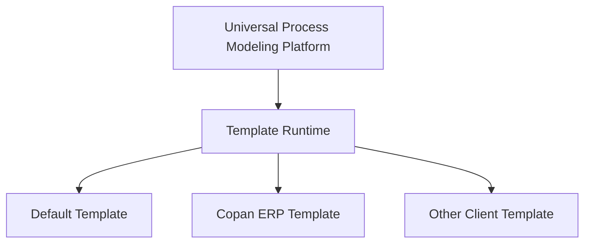

# Core Platform / Copan Template Separation Audit

|Field|Value|
|---|---|
|Title|Core Platform / Copan Template Separation Audit|
|Purpose|Universal Process Modeling Platform과 Copan ERP Template/Data를 장기적으로 분리 가능한 구조로 만들기 위해 현재 하드코딩 요소, Layer Separation, export/import 방향, 데이터 경계 관리 기준을 점검한다.|
|Status|Draft|
|Owner|Project Team|
|Last Updated|2026-06-27|
|Related Docs|`universal-platform-template-layer-audit.md`, `../../01_Architecture/Architecture.md`, `../../01_Architecture/LocalDevelopment.md`, `../../01_Architecture/TemplatePackage.md`, `../../02_Master/SystemMappingMaster.md`, `../../06_Data/Samples/scm to-be process.pdf`|

## 1. 핵심 원칙

장기 구조는 다음처럼 해석한다.



Core Platform은 범용 프로세스 모델링 기능을 제공한다. Copan ERP 프로세스는 Core 위에서 동작하는 Template, Sample, Client Data로 분리한다.

현재 작업 범위는 배포/호스팅이 아니라 로컬 개발환경에서의 구조 분리다.

원칙:
- Core 코드에는 Copan 전용 명칭, 조직명, 업무명, ERP 명칭을 직접 넣지 않는다.
- Copan 값은 config/template/data/docs 계층에만 둔다.
- `state.json`, `commonMasters`, `process-data`는 향후 template package로 export/import 가능해야 한다.
- UI는 active template을 선택하거나 표시할 수 있어야 한다.
- Copan Template은 기본 사용 사례일 수 있지만 Core Platform 자체가 되어서는 안 된다.

현재 제외 범위:
- Firebase
- AWS
- Hosting
- Auth
- Firestore
- Cloud Storage
- Google Workspace 로그인 연동
- 배포 설정

## 2. Core에 남아 있는 Copan-specific 요소

|우선순위|파일|Copan-specific 요소|현재 위험|분리 방향|
|---:|---|---|---|---|
|1|`src/components/layout/Toolbar.tsx`|`Copan ERP Process Navigator` 제목 하드코딩|Core UI 브랜드가 Copan으로 고정된다.|`appConfig.platformName`, `activeTemplate.displayName`으로 분리|
|1|`src/lib/layout/overviewProcessZones.ts`|`사업·계약·프로젝트`, `구매·발주`, `입고·재고·매입`, `판매·출고·매출`, `정산·자금` 및 Copan nodeId mapping|Core layout이 Copan 업무 분류와 nodeId를 안다.|Copan Template `layoutRules/overviewZones`로 이동|
|1|`src/lib/layout/settlementGroupLayout.ts`|위탁정산, 로열티/MG, 정산 nodeId별 cellSlot/cellOrder|정산 특화 배치가 Platform Layout Engine에 있다.|Copan Template `layoutRules/settlement`로 이동|
|1|`src/lib/layout/returnMovementGroupLayout.ts`|반품/이동/기타출고 대표 노드 배치|Copan Overview 대표 노드 id에 의존한다.|Copan Template `layoutRules/returnMovement`로 이동|
|1|`src/lib/overviewEdgeLabels.ts`|`ERP`, `재고인식(+)`, `재고인식(-)`, `(ERP→WMS)`, `(POS→ERP)`, `(온라인몰→OMS)`|Core edge label inference가 Copan SCM 시스템 흐름을 안다.|Copan Template `systemMapping` 또는 `edgeLabelPolicy`로 이동|
|2|`src/types/nodeTypes.ts`|기본 시스템값 `ERP`, `이지어드민/WMS`, `이지체인/POS`, `그룹웨어`, `DATABASE`, `API`|Node type과 client system mapping이 결합되어 있다.|Core node type과 Template system defaults 분리|
|2|`src/types/overviewNodeTypes.ts`|TO-BE PDF 범례, `retail-easychain`, `warehouse-easyadmin`, 이지어드민/이지체인/POS 추론|Overview type inference가 Copan lane/system id에 의존한다.|Template-aware `nodeTypeResolver`로 이동|
|2|`src/types/process.ts`|주석 `PDF ERP 단계 번호`, `ERP TO-BE`, `SCM TO-BE`|타입 자체는 범용이나 언어가 Copan ERP 중심이다.|platform-neutral 용어로 정리 필요|
|2|`src/lib/overviewNodeDisplay.ts`|Overview node subtitle과 `(AUTO)` 표시 정책이 ERP/PDF 범례 중심|Core display policy가 template presentation을 포함한다.|Template display policy로 분리|
|3|`src/lib/layout/detailVerticalLayout.ts`|주석과 기본 설명이 PDF/사업부 단일 lane 중심|알고리즘보다 문서화와 default assumption 문제|문서 정리 또는 default detail layout rule로 분리|
|3|`src/components/process-map/nodes/process-node.css`|PDF 기준 WMS/POS 색상 주석|theme token으로 일반화할 수 있음|Core theme + template theme로 분리|

## 3. Template으로 옮겨야 할 파일/데이터

### 3.1 Copan Template Data

|현재 위치|권장 Template 위치|설명|
|---|---|---|
|`public/process-data/state.json`|`templates/copan-erp/state.json` 또는 별도 package `copan-erp-template/process-data/state.json`|현재 runtime state. 향후 export/import 대상.|
|`src/data/toBeOverview/*`|`templates/copan-erp/to-be-overview/*`|SCM TO-BE Overview와 process group registry.|
|`src/data/processes/*.json`|`templates/copan-erp/processes/*.json`|Copan detail process instances.|
|`src/data/processRegistry.json`|`templates/copan-erp/processRegistry.json`|Template process registry.|
|`src/data/lanes.json`|`templates/copan-erp/masters/lanes.json` 또는 Template Lane Master|Copan 조직/lane 구조.|
|`Docs/04_Audit/Process/*`|`templates/copan-erp/docs/audit/process/*`|Copan SCM audit 자료.|
|`Docs/04_Audit/Numbering/detail-step-badge-audit.md`|`templates/copan-erp/docs/audit/numbering/*`|Copan detail numbering 정책 audit.|
|`Docs/06_Data/Samples/*`|`templates/copan-erp/docs/samples/*`|SCM TO-BE PDF 등 client sample/source.|
|`Docs/06_Data/Migration/*`|`templates/copan-erp/docs/migration/*`|Copan legacy migration 자료.|
|`Docs/06_Data/Mapping/*`|`templates/copan-erp/docs/mapping/*`|Copan legacy phase mapping.|

### 3.2 Copan Template Config

|현재 위치|권장 Template 위치|설명|
|---|---|---|
|`src/lib/layout/overviewProcessZones.ts`|`templates/copan-erp/layoutRules/overviewProcessZones.ts/json`|Copan Overview 업무 zone rule.|
|`src/lib/layout/settlementGroupLayout.ts`|`templates/copan-erp/layoutRules/settlementGroupLayout.ts/json`|Copan settlement special placement.|
|`src/lib/layout/returnMovementGroupLayout.ts`|`templates/copan-erp/layoutRules/returnMovementGroupLayout.ts/json`|Copan return/movement special placement.|
|`src/lib/overviewEdgeLabels.ts`|`templates/copan-erp/policies/edgeLabelPolicy.ts/json`|Copan system integration label preset.|
|`src/types/nodeTypes.ts` 일부|`templates/copan-erp/masters/systemMappingMaster.json`|Node type별 Copan 기본 시스템명.|
|`src/types/overviewNodeTypes.ts` 일부|`templates/copan-erp/policies/overviewNodeTypePolicy.ts/json`|Copan PDF legend mapping.|

## 4. 향후 Repo 분리 가능 구조

### 4.1 단일 저장소 내 준비 단계

먼저 monorepo가 아니어도 폴더 경계부터 만든다.

```text
src/
  platform/
    canvas/
    editor/
    layout/
    routing/
    diagnostics/
    import-export/
    generator/
  modeling/
    definition/
    master/
    validation/
  templates/
    default/
    copan-erp/
      template.json
      masters/
      process-data/
      layout-rules/
      policies/
      docs/
```

장점:
- 기존 앱 실행 경로를 크게 흔들지 않고 경계만 만든다.
- import path를 점진적으로 바꿀 수 있다.
- Copan Template export/import 형식을 먼저 검증할 수 있다.
- 로컬 개발환경에서 구조 분리와 저장 안정화를 먼저 확인할 수 있다.

### 4.2 장기 저장소 분리안

```text
universal-process-modeler/
  packages/
    platform-core/
    modeling-core/
    react-editor/
    generator-framework/
    template-sdk/

copan-erp-process-template/
  template.json
  masters/
  process-data/
  layout-rules/
  policies/
  docs/
  samples/
```

Core Platform 저장소:
- 범용 기능과 SDK만 포함
- client data 미포함
- 샘플은 공개 가능한 generic sample만 포함

Copan Template 저장소:
- Copan 전용 데이터, 문서, PDF, 조직명, 업무명 포함
- 별도 접근권한 관리 권장
- Core Platform에서 import 가능한 package 형식 유지

이 저장소 분리안은 현재 구현 범위가 아니라, 로컬 구조 분리가 끝난 뒤 가능한 미래 구조다.

### 4.3 Template Manifest 초안

```json
{
  "templateId": "copan-erp",
  "displayName": "Copan ERP Template",
  "version": "0.1.0",
  "owner": "Copan Global",
  "license": "Private / Client Confidential",
  "entry": {
    "state": "process-data/state.json",
    "masters": "masters/commonMasters.json",
    "processes": "process-data/processes",
    "layoutRules": "layout-rules",
    "policies": "policies"
  },
  "capabilities": {
    "overview": true,
    "detail": true,
    "generator": false,
    "editable": true
  }
}
```

## 5. Export / Import 설계 방향

현재 export/import는 local JSON package 기준으로 설계한다. Firebase, cloud storage, auth, deployment 연동은 포함하지 않는다.

### 5.1 Export 대상

Copan Template export는 다음을 포함해야 한다.

- `template.json`
- `commonMasters`
- lane/zone/stage/system mapping master
- overview process
- detail process instances
- process group registry
- template-specific layout rules
- template-specific edge/node display policies
- migration/mapping metadata
- optional docs/audit/review
- optional source samples, 단 권리 확인 후 포함

### 5.2 Export에서 제외할 것

- Core Platform source code
- user local preferences
- browser/session state
- build artifact
- credentials
- Firebase/API credentials
- cloud provider configuration
- auth provider configuration
- template에 포함 권한이 없는 PDF/source document

### 5.3 Import Runtime

Core Platform은 다음 interface만 알면 된다.

```ts
type ProcessTemplatePackage = {
  manifest: TemplateManifest
  masters: CommonMasters
  processes: ProcessInstance[]
  registries: TemplateRegistries
  layoutRules?: TemplateLayoutRules
  policies?: TemplatePolicies
}
```

Core는 `templateId`나 `displayName`을 표시할 수 있지만, `Copan`, `ERP`, `SCM` 같은 값 자체를 해석하지 않는다. 해석은 Template Adapter가 맡는다.

### 5.4 UI Template Selector

UI 구조 방향:

```text
Template
  Default Template
  Copan ERP Template
  Import Template...
  Export Active Template...
```

권장 표시:
- Platform title: `Universal Process Modeler`
- Active template: `Copan ERP Template`
- Active process: `SCM TO-BE Overview` 또는 상세 process name

## 6. Docs 구조에 반영해야 할 Template 분리 원칙

현재 `Docs`는 프로젝트 문서 허브로 정리되어 있으나, Copan 전용 문서와 Platform Architecture 문서가 같은 tree에 있다. 장기적으로는 다음처럼 분리할 수 있다.

```text
Docs/
  00_Project/
  01_Architecture/
  02_Master/
  03_Guides/
  04_Audit/
    Architecture/
  05_Review/
  06_Data/
    Samples/
  07_Archive/
  Templates/
    CopanERP/
      Audit/
      Review/
      Data/
      Samples/
      Decisions/
```

또는 저장소 분리 후:

```text
universal-process-modeler/Docs/
  Architecture/
  Platform Guides/
  SDK Guides/

copan-erp-process-template/Docs/
  Copan Process Audit/
  Copan Data Mapping/
  SCM Source Samples/
  Copan Decisions/
```

이번 audit 기준으로는 문서 이동을 실행하지 않았다. 다만 향후 Copan docs/audit/review는 Template package와 함께 이동 가능한 구조로 관리해야 한다.

현재 문서 기준은 local-first다. cloud, hosting, auth 문서는 현재 scope 밖이며, 필요 시 별도 Future Architecture로 분리한다.

## 7. 데이터 경계 / 접근권한 관리 기준

현재 관찰:
- 루트 `package.json`은 `"private": true`다.
- 루트 LICENSE 파일은 확인되지 않았다.
- `node_modules`에는 dependency별 license가 있으나, 프로젝트 배포 정책은 별도 정의되어 있지 않다.
- `Docs/06_Data/Samples`에는 SCM TO-BE PDF 등 client/source 자료가 포함되어 있다.

주의사항:
- Core Platform의 재사용성을 유지하려면 Core repository에는 Copan 업무 데이터와 source 자료를 두지 않는 것이 안전하다.
- Copan 업무명, 조직명, process data, PDF 원본은 business domain data로 취급하는 것이 안전하다.
- Core Platform 배포 또는 재사용 가능성을 열어두려면 배포 정책과 dependency license 검토 기준을 명확히 정해야 한다.
- Copan Template repository 또는 package는 접근권한을 제한하는 것이 적절하다.
- Template export 파일에 PDF 원본이나 내부 프로세스 문서가 포함될 경우 별도 권한 확인이 필요하다.
- third-party dependency license는 Core Platform 배포 전 별도 검토가 필요하다.
- Generator로 생성된 output은 Core code, template data, generated process artifact를 구분해 관리해야 한다.

권장 구분:

|자산|권장 관리 기준|
|---|---|
|Core Platform source|범용 Platform code로 관리|
|Generic sample templates|Core repository 포함 가능|
|Copan ERP Template data|Copan business domain data로 관리|
|SCM TO-BE PDF/source docs|접근권한이 필요한 source document로 관리|
|Generated Copan process maps|Template data에서 파생된 process asset으로 관리|
|Generator framework|Core Platform asset|

## 8. 리팩토링 우선순위

### Priority 1. Template Manifest와 Active Template 개념 추가

목표:
- Core가 현재 데이터가 Copan인지 모르고 active template으로만 다루게 한다.
- `templateId`, `displayName`, `version`, `entrypoints`를 정의한다.
- local JSON package로 import/export 가능하게 한다.

### Priority 2. Branding 분리

목표:
- `Copan ERP Process Navigator`를 Core 하드코딩에서 제거한다.
- Platform name과 Template name을 분리 표시한다.

### Priority 3. Copan Layout Rule 분리

대상:
- `overviewProcessZones.ts`
- `settlementGroupLayout.ts`
- `returnMovementGroupLayout.ts`

목표:
- Core Layout Engine은 rule interface만 사용한다.
- Copan rule은 template package에서 로드한다.

### Priority 4. System Mapping Master 분리

대상:
- `nodeTypes.ts`
- `overviewNodeTypes.ts`
- `overviewEdgeLabels.ts`

목표:
- Core는 node type과 edge type만 안다.
- Copan-specific system defaults, labels, colors, integration names는 template policy로 이동한다.

### Priority 5. Export / Import Package 구현

목표:
- Active Template을 JSON package로 export
- Template package import 후 Platform에서 로드
- local storage adapter 기준으로 저장/불러오기 안정화
- Core repository와 Copan template repository 분리 가능성 검증

비목표:
- Firebase
- hosting
- auth
- cloud sync

## 9. 결론

현재 프로젝트는 이미 Universal Process Modeling Platform으로 확장할 수 있는 기반을 갖고 있다. 다만 Copan ERP Template을 빠르게 구현하는 과정에서 일부 Copan-specific 값이 Core 위치에 남아 있다.

장기 목표가 재사용 가능한 Core Platform이라면 가장 중요한 기준은 다음이다.

> Core는 프로세스를 그리는 방법과 모델링 규칙만 가진다. Copan은 그 위에서 실행되는 하나의 Template Package다.

따라서 다음 작업은 코드 대수술이 아니라 경계 설정이다.

1. active template 개념 정의
2. Copan template manifest 작성
3. Core hardcoding audit 항목을 template config로 이동할 계획 수립
4. export/import package format 정의
5. 배포 정책과 business domain data 경계 확정
