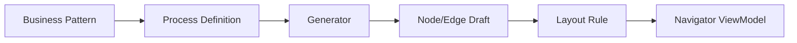

# Universal Platform / Copan Template Architecture Audit

|Field|Value|
|---|---|
|Title|Universal Platform / Copan Template Architecture Audit|
|Purpose|현재 코드와 Docs 구조가 Universal Process Modeling Platform과 Copan ERP Operating Template의 이중 목적에 맞게 분리되어 있는지 점검한다.|
|Status|Draft|
|Owner|Project Team|
|Last Updated|2026-06-27|
|Related Docs|`../../README.md`, `../../01_Architecture/Architecture.md`, `../../01_Architecture/LocalDevelopment.md`, `../../01_Architecture/TemplatePackage.md`, `../../02_Master/ProcessDefinition.md`|

## 1. 재정의된 프로젝트 목적

이 프로젝트는 두 목적을 동시에 가진다.

현재 작업 범위는 local server와 local storage 기준의 개발/테스트다. Firebase, AWS, hosting, auth, Firestore, Cloud Storage, Google Workspace 로그인 연동, 배포 설정은 이번 구조 분리 범위에서 제외한다.

### 1.1 Universal Process Modeling Platform

특정 회사나 ERP에 종속되지 않는 범용 프로세스 편집/모델링 플랫폼이다.

범용 계층에 속해야 하는 것:
- Node / Edge / Lane / Zone
- Layout Engine
- Routing Engine
- Canvas / Editor
- Property Panel
- Import / Export
- Diagnostics
- Process Definition
- Business Activity
- Process Pattern
- Generator
- Validation
- Master Data

### 1.2 Copan ERP Operating Template

범용 플랫폼 위에서 동작하는 코팬글로벌 TO-BE ERP 프로세스 템플릿이다.

템플릿 계층에 속해야 하는 것:
- SCM TO-BE Overview
- Process Detail
- Copan 사업유형/계약/프로젝트/구매/입고/출고/정산/회계 흐름
- Copan system mapping
- Copan business pattern
- Copan process data

## 2. 현재 구조가 범용 플랫폼에 적합한 부분

|구분|파일/영역|현재 역할|범용성 평가|비고|
|---|---|---|---|---|
|Platform Core|`src/lib/layout/orthogonalEdgeRouter.ts`|직교 연결선 라우팅|높음|업무명보다 geometry, handle, obstacle 중심으로 동작한다.|
|Platform Core|`src/lib/layout/buildOrthogonalFlowEdge.ts`|router 결과를 edge view로 변환|높음|edge data와 path 생성 책임이 분리되어 있다.|
|Platform Core|`src/lib/layout/edgeRouteValidation.ts`|edge routing validation|높음|node/edge 충돌과 경로 유효성 중심이다.|
|Platform Core|`src/lib/editor/edgeHandles.ts`|handle normalize/validation|높음|특정 업무 프로세스 의존도가 낮다.|
|Platform Core|`src/lib/editor/edgeUpdate.ts`|edge update helper|높음|edge 편집 로직 중심이다.|
|Platform Core|`src/lib/editor/nodeClipboard.ts`|node copy/paste|높음|node metadata 복제 규칙은 일반화 가능하다.|
|Platform Core|`src/lib/editor/shortcutManager.ts`|단축키 추상화|높음|OS별 shortcut layer로 범용성이 높다.|
|Platform Core|`src/components/process-map/ProcessMapCanvas.tsx`|canvas 렌더와 선택 처리|중간~높음|대체로 범용이나 active process/menu와 결합되어 있다.|
|Platform Core|`src/components/editor/PropertyPanel.tsx`|속성 편집 UI|중간|정보 구조는 범용적이나 일부 Overview/Detail/Copan 표시 로직과 결합되어 있다.|
|Modeling Layer|`src/definition/types.ts`|Process Definition 타입|높음|업무 흐름 모델로 확장 가능하다.|
|Modeling Layer|`src/definition/resolver.ts`|Legacy JSON → Process Definition 변환|높음|Generator 전 단계 adapter 역할을 한다.|
|Modeling Layer|`src/definition/generator.ts`|Generator interface|높음|구현 전 interface만 있어 범용 계층에 적합하다.|
|Modeling Layer|`src/engine/*`|engine contract, viewModel, adapters|높음|기존 실행 경로와 병렬 shadow model 구조가 있다.|
|Data Layer|`public/process-data/state.json`|runtime state|적절|Copan template instance data로 볼 수 있다.|
|Docs|`Docs/01_Architecture/*`|설계 기준|방향 적합|다만 명칭이 아직 ERP/Copan 중심인 곳이 있다.|

## 3. Copan 전용으로 분리해야 할 부분

아래 항목은 현재 core 또는 shared type/lib 영역에 있지만, 장기적으로 Template/Data/Config 계층으로 내려가는 것이 적절하다.

|우선순위|현재 위치|현재 내용|문제|권장 이동 위치|
|---:|---|---|---|---|
|1|`src/lib/layout/overviewProcessZones.ts`|`사업·계약·프로젝트`, `구매·발주`, `입고·재고·매입`, `판매·출고·매출`, `정산·자금` zone 및 nodeId별 배치 fallback|Copan/SCM 업무 zone과 nodeId가 layout library에 박혀 있다.|`src/templates/copan/layout/overviewProcessZones.ts` 또는 `src/data/toBeOverview/*`|
|1|`src/lib/layout/settlementGroupLayout.ts`|위탁정산, 로열티/MG, 정산 nodeId별 cellSlot/cellOrder|정산 특화 업무 배치가 layout engine에 있다.|Copan layout rule master 또는 template layout config|
|1|`src/lib/layout/returnMovementGroupLayout.ts`|반품/이동/기타출고 대표 노드 배치|Copan Overview 대표 노드 id에 의존한다.|Copan template layout config|
|1|`src/lib/overviewEdgeLabels.ts`|`ERP`, `재고인식(+)`, `(ERP→WMS)`, `(POS→ERP)`, `(온라인몰→OMS)` label preset|Copan/SCM 시스템 라벨 추론이 shared lib에 있다.|System Mapping Master 또는 Copan edge label policy|
|2|`src/types/overviewNodeTypes.ts`|TO-BE PDF 범례, 이지어드민/이지체인/POS lane 추론|Overview type 자체는 범용 가능하나 PDF/Copan 시스템 추론이 섞여 있다.|범용 `nodeType` + Copan `systemMappingMaster`로 분리|
|2|`src/types/nodeTypes.ts`|기본 시스템값 `ERP`, `이지어드민/WMS`, `이지체인/POS`, `그룹웨어`|Node type master가 특정 시스템명을 기본값으로 가진다.|범용 node type과 Copan default system mapping 분리|
|2|`src/components/layout/Toolbar.tsx`|제목 `Copan ERP Process Navigator`|플랫폼 브랜드와 템플릿 이름이 UI core에 하드코딩되어 있다.|app config / template metadata|
|2|`src/lib/layout/detailVerticalLayout.ts`|주석과 개념이 PDF/사업부 단일 lane 기준|기능 자체는 범용이나 설명과 기본 가정은 Copan detail에 가깝다.|문서/명칭 정리 또는 template layout rule로 분리|
|3|`src/types/process.ts`|주석 `ERP TO-BE`, `SCM TO-BE`, `PDF ERP 단계 번호`|타입 자체는 범용 가능하나 명칭이 프로젝트 특정이다.|주석과 필드 설명을 platform-neutral하게 정리|
|3|`src/lib/overviewNodeDisplay.ts`|Overview node subtitle이 PDF 범례/ERP system 중심|표시 정책이 template 성격을 가진다.|template display policy|
|3|`src/components/process-map/nodes/process-node.css`|PDF 기준 WMS/POS 색상 주석|색상 자체는 theme로 일반화 가능하다.|theme/token 또는 template theme|

## 4. 현재 파일 분류

### 4.1 Platform Core

|영역|파일/폴더|비고|
|---|---|---|
|Canvas / Rendering|`src/components/process-map/*`|범용 canvas로 유지 가능. 일부 Overview-specific component는 분리 후보.|
|Editor|`src/lib/editor/*`|대체로 범용. `processGroupMembership`, `overviewZoneMembership`은 template와 결합 가능성 있음.|
|Property Panel|`src/components/editor/*`|범용 UI로 유지 가능. process group/detail links는 template adapter 필요.|
|Layout Engine|`src/lib/layout/orthogonalEdgeRouter.ts`, `buildOrthogonalFlowEdge.ts`, `edgeRouteValidation.ts`, `cellColumnLayout.ts`, `detailHorizontalLayout.ts`, `overviewGridLayout.ts`|대체로 범용. 일부 Copan-special layout helper는 분리 대상.|
|Import / Export|`src/data/processExport.ts`, `src/data/processDataIO.ts`, `src/data/processPersistence.ts`|현재 Data Layer와 결합되어 있으나 기능은 범용화 가능.|
|Diagnostics|`src/engine/legacyShadowRun.ts`, layout validation files|범용 진단 계층으로 확장 가능.|
|Shortcut / Clipboard|`src/lib/editor/shortcutManager.ts`, `src/lib/editor/nodeClipboard.ts`|범용 유지 적합.|

### 4.2 Modeling Layer

|영역|파일/폴더|비고|
|---|---|---|
|Process Definition|`src/definition/types.ts`, `src/definition/resolver.ts`, `src/definition/index.ts`|기존 JSON을 정의 모델로 해석하는 통로.|
|Generator Interface|`src/definition/generator.ts`|아직 구현 전. 범용 interface 위치로 적절.|
|Engine Contract|`src/engine/contracts.ts`, `src/engine/types.ts`, `src/engine/viewModel.ts`|Process Model → ViewModel 전환의 기반.|
|Legacy Adapter|`src/engine/adapters/fromLegacyProcess.ts`, `toNavigatorViewModel.ts`|현재와 미래 구조를 연결하는 adapter.|
|Master Resolver|`src/lib/master/*`|Master Layer 도입 경로.|
|Validation|`src/lib/layout/processFlowValidation.ts`, `src/lib/layout/edgeRouteValidation.ts`|향후 Modeling Validation과 Routing Validation으로 분리 가능.|

### 4.3 Copan Template Layer

|영역|파일/폴더|비고|
|---|---|---|
|Overview Template|`src/data/toBeOverview/*`|Copan SCM TO-BE template로 분류.|
|Detail Processes|`src/data/processes/*.json`|Copan process template instances.|
|Registry|`src/data/toBeNavigatorRegistry.ts`, `src/data/processRegistry.json`|현재 Copan template registry.|
|Menu Groups|`src/data/toBeOverview/detail-process-groups.json`, `overview-process-groups.json`, `process-groups.json`|Copan process group metadata.|
|Copan Layout Exceptions|`src/lib/layout/overviewProcessZones.ts`, `settlementGroupLayout.ts`, `returnMovementGroupLayout.ts`|현재 core 위치지만 template layer로 이동 권장.|
|Copan Display Rules|`src/lib/overviewEdgeLabels.ts`, `src/types/overviewNodeTypes.ts` 일부|Copan system/label mapping 성격.|

### 4.4 Data Layer

|영역|파일/폴더|비고|
|---|---|---|
|Runtime State|`public/process-data/state.json`|현재 앱 실행 데이터.|
|Common Masters|`state.json.commonMasters`, `src/types/commonMasters.ts`|공통 master schema와 instance data.|
|Migration|`src/data/processDataMigration.ts`, `Docs/06_Data/Migration/*`|legacy → normalized data migration.|
|Mapping|`Docs/06_Data/Mapping/*`|legacy phase 등 mapping 자료.|
|Audit Data|`Docs/04_Audit/*`|현재 상태 fact 기록.|
|Samples|`Docs/06_Data/Samples/*`|SCM TO-BE PDF 등 원천 자료.|

## 5. Copan 전용 로직 Audit 상세

### 5.1 Core Engine에는 직접적인 Copan 회사명 로직은 적다

`src/engine`과 `src/definition`에서는 Copan, SCM, ERP 업무명을 직접 판단하는 로직이 거의 없다. 현재 engine contract와 adapter는 비교적 platform-neutral하다.

### 5.2 Layout library에는 Copan 업무 배치가 일부 박혀 있다

`src/lib/layout/overviewProcessZones.ts`, `settlementGroupLayout.ts`, `returnMovementGroupLayout.ts`는 nodeId와 업무 zone을 직접 알고 있다. 이들은 layout algorithm이라기보다 Copan Template Layout Rule에 가깝다.

영향:
- 다른 회사 템플릿을 넣으면 해당 nodeId fallback이 의미 없어짐
- Business Pattern Generator를 붙일 때 core layout과 template-specific placement가 충돌할 수 있음
- Layout Engine을 범용으로 문서화하기 어렵다

### 5.3 Node Type과 System Mapping이 섞여 있다

`src/types/nodeTypes.ts`와 `src/types/overviewNodeTypes.ts`는 `erp`, `wms-oms`, `pos` 같은 유형 자체는 재사용 가능하지만, 기본 시스템명으로 `이지어드민/WMS`, `이지체인/POS`, `그룹웨어`가 들어가 있다.

권장 해석:
- `nodeType`: 범용 분류
- `system`: template/data 값
- `defaultSystemForNodeType`: Copan System Mapping Master

### 5.4 Edge label 추론이 Copan 시스템 흐름을 안다

`src/lib/overviewEdgeLabels.ts`는 `(ERP→WMS)`, `(POS→ERP)`, `(온라인몰→OMS)`, `재고인식(+)` 등을 직접 preset으로 가진다. 이는 범용 edge label engine이 아니라 Copan SCM integration label policy다.

### 5.5 UI Branding이 template와 결합되어 있다

`src/components/layout/Toolbar.tsx`의 기본 제목은 `Copan ERP Process Navigator`다. 플랫폼 이름과 템플릿 이름을 분리하려면 App Config 또는 Template Metadata로 내려야 한다.

## 6. Generator 도입 전 선행 정리 필요 항목

|우선순위|정리 항목|이유|권장 결과|
|---:|---|---|---|
|1|Template Config 경계 만들기|core layout에 Copan nodeId fallback이 있음|`platform core`는 규칙만, `template`은 Copan rule만 보유|
|1|Node Type과 System Mapping 분리|type 선택 시 Copan 시스템명이 자동 주입됨|범용 node type + template system default resolver|
|1|Overview Zone Rule을 Master/Template화|Copan 업무 zone이 layout lib에 있음|Zone Master 또는 Process Pattern Layout Rule로 이동|
|2|Edge Label Policy 분리|연동 라벨이 Copan SCM 기준|Edge Master 또는 SystemMappingMaster에서 label 생성|
|2|Brand/App Metadata 분리|Toolbar가 Copan 전용 제목을 가짐|Platform title + active template title 분리|
|2|Process Group Registry 일반화|현재 `toBeNavigator` 중심|Template registry interface 정의|
|3|Docs Architecture 명칭 업데이트|Docs가 아직 ERP Process Navigator 중심|Universal Platform + Copan Template 이중 목적 반영|
|3|Audit/Review 문서 분류 유지|향후 AI/개발자 협업 기준 필요|Architecture/DecisionLog에 확정 사항 반영|

## 7. 향후 리팩토링 우선순위

### Phase A. Architecture 문서 승격

목표:
- `Docs/01_Architecture/Architecture.md`를 Universal Platform + Template Layer 기준으로 업데이트
- `Docs/00_Project/Vision.md`, `Scope.md`에서 Copan을 기본 템플릿으로 명확히 표현

코드 영향:
- 없음

### Phase B. Template Boundary 추가

목표:
- Copan-specific registry/config를 `template` 개념으로 분리
- 현재 data 파일은 유지하되 adapter 명칭을 platform-neutral하게 정리

후보 구조:

```text
src/
  platform/
    layout/
    routing/
    editor/
    rendering/
  modeling/
    definition/
    generator/
    master/
  templates/
    copan-erp/
      data/
      masters/
      layout-rules/
      system-mapping/
      process-patterns/
```

### Phase C. Copan Layout Exceptions 이동

목표:
- `overviewProcessZones.ts`
- `settlementGroupLayout.ts`
- `returnMovementGroupLayout.ts`

위 파일의 nodeId 기반 rule을 Copan Template Layout Rule로 이동한다.

주의:
- 이동 전 adapter를 두어 화면 변화가 없어야 한다.
- Layout Engine algorithm 자체는 수정하지 않는다.

### Phase D. System Mapping Master 도입

목표:
- `이지어드민/WMS`, `이지체인/POS`, `ERP`, `Groupware` 기본값을 template config로 이동
- core node type은 `enterprise-system`, `warehouse-system`, `point-of-sale`, `manual`, `approval` 등 범용 의미만 갖게 한다.

### Phase E. Generator Rule 설계

목표:
- Business Pattern → Process Definition → Node/Edge/Layout 초기 모델 생성
- Copan Pattern은 template layer에 보관

예:



## 8. 결론

현재 구조는 이미 다음 부분에서 범용 플랫폼으로 발전할 기반을 갖고 있다.
- engine contract
- Process Definition resolver
- Navigator ViewModel adapter
- Layout/Routing 함수 분리
- Property Panel 정보 계층
- Diagnostics/Shadow Engine 방향

다만 Copan ERP Operating Template 성격의 값이 일부 core/shared 영역에 남아 있다.

가장 먼저 분리해야 할 것은 algorithm이 아니라 config다.

우선 분리 대상:
1. Overview zone/nodeId layout fallback
2. Settlement/return movement special layout
3. Node type default system mapping
4. Overview edge label presets
5. Toolbar branding

이 다섯 가지가 정리되면, core engine은 범용 플랫폼으로 유지하고 Copan ERP는 기본 템플릿으로 자연스럽게 내려갈 수 있다.
