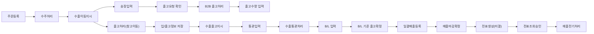

# Process 05 Review Package

|Field|Value|
|---|---|
|Title|Process 05 Review Package|
|Purpose|`주문 등록 ~ 수출 출고 ~ 매출 전표 : B2B 해외` Process를 Internal Review 및 Business Review에 제출하기 위한 공식 검토 자료|
|Status|Internal Review Ready|
|Owner|혁신팀|
|Last Updated|2026-06-28|
|Related Docs|`../../06_Data/02_Mapping/ProcessMapping.md`, `../../06_Data/02_Mapping/DouzoneProcessCoverage.md`, `../../06_Data/02_Mapping/ProcessAuthoringStandard.md`, `../../02_Master/NodeDefinitionStandard.md`|

## 1. Process Summary

|Item|Value|
|---|---|
|Process No|06|
|Navigator Process|주문 등록 ~ 수출 출고 ~ 매출 전표 : B2B 해외|
|Process ID|`b2b-export-order-to-sales`|
|Business Capability|해외업무 / 영업·주문관리 / 출고관리 / 재고관리 / 회계·전표관리|
|Douzone Source|자사 재고 해외 B2B PROCESS / 위탁 재고 해외 B2B PROCESS|
|Douzone Page|Douzone PDF pp.64-65|
|Copan Interpretation Source|SCM TO-BE PDF p.7|
|Current Review Stage|Internal Review Ready|
|Coverage Handling|Approved 이후 Coverage Update|

## 2. 변경 요약

Process 05은 해외 B2B 주문부터 수출 출고, 해외 가상창고 재고이동, B/L 기준 출고확정, 매출마감, 전표생성, 재무 승인까지 이어지는 흐름으로 정리했다.

이번 Review Package 기준 Navigator에는 아래 흐름이 반영되어 있다.

## 3. 혁신팀 확인 완료 사항

아래 항목은 Navigator 작성 기준으로 사전 점검한 사항이다.

|Check Item|Result|Note|
|---|---|---|
|Douzone Source 확인|완료|Douzone PDF pp.64-65의 자사 재고 해외 B2B / 위탁 재고 해외 B2B PROCESS를 기준으로 확인|
|SCM TO-BE 확인|완료|SCM TO-BE PDF p.7의 B2B 해외 제/상품 흐름 확인|
|Business Capability 확인|완료|해외업무, 영업·주문관리, 출고관리, 재고관리, 회계·전표관리로 분류|
|Business Activity 확인|완료|수주처리, 수출이동지시, 송장입력, 수출통관처리, B/L 입력, 매출마감확정 등 반영|
|Execution System 확인|완료|OmniEsol ERP, EasyAdmin WMS, DATABASE로 구분|
|Owner/Lane 기준 확인|완료|Lane은 Execution System이 아니라 Owner 기준으로 정리|
|Auto Node 기준 확인|완료|입/출고정보 저장, 전표생성(미결)은 직전 Business Activity Owner 기준 적용|
|Broken Edge 확인|완료|Process 05 기준 broken edge 0|

## 4. Douzone와 다른 부분

Navigator는 Douzone 원문을 그대로 복제하지 않고 Copan 운영 기준으로 재구성했다.

|Area|Douzone Source|Navigator / Copan Interpretation|Reason|
|---|---|---|---|
|자사/위탁 해외 B2B|Douzone에서는 자사 재고 해외 B2B와 위탁 재고 해외 B2B가 별도 Source Process로 제시됨|Navigator Process 05 안에서 통합 표현|Copan Review에서는 해외 B2B 흐름을 하나의 업무 흐름으로 보고, 위탁재고 정산은 후속 정산 Process에서 별도 검토|
|Lane 기준|Douzone 도식은 시스템/프로세스 구간 중심으로 표현|Navigator는 Owner 기준 Lane 사용|현업 R&R을 명확히 하기 위해 Execution System과 Owner를 분리|
|출고 처리|Douzone에는 출고요청 API, 출고처리 API, 출고정보 Database가 표시됨|EasyAdmin WMS의 출고요청 확인, B2B 출고처리, 출고수량 입력으로 표현|Copan 물류센터 실운영 확인 단계를 Review 가능하게 분리|
|송장/B/L/통관|Douzone에는 송장입력, 통관입력, 수출통관처리, B/L 입력이 포함됨|Navigator에 별도 Business Activity로 반영|해외업무 Review 시 누락 없이 검토하기 위함|
|해외 가상창고|Douzone에는 출고창고 재고(-), 입고창고 재고(+), 해외 가상창고 이동 흐름 표시|Navigator에는 출고처리(창고이동), 입/출고정보 저장, ERP 재고현황으로 표현|재고 이동과 저장/조회 Node를 분리해 현업 확인 가능하게 구성|
|전표 처리|Douzone에는 일괄매출등록, 매출전기처리, 전표조회승인이 표시됨|Navigator에는 일괄매출등록, 매출마감확정, 전표생성(미결), 전표조회승인, 매출전기처리로 표현|Copan 운영 기준상 Auto 전표생성과 재무 승인 단계를 구분|

## 5. Copan 운영 반영 내용

|Category|Copan 반영 내용|
|---|---|
|Owner 기준 Lane|사업부, 물류센터, 재무관리팀을 Owner 기준으로 구분|
|Execution System 분리|ERP 업무는 OmniEsol ERP, 물류 출고는 EasyAdmin WMS, 정보 저장은 DATABASE로 분리|
|Auto Node Owner|전표생성(미결)은 ERP 자동 처리이지만 직전 매출마감확정 Owner인 사업부 Lane 유지|
|물류 운영|출고요청 확인, B2B 출고처리, 출고수량 입력을 물류센터 업무로 표현|
|해외업무|송장입력, 통관입력, 수출통관처리, B/L 입력을 별도 Node로 표현|
|재고 운영|출고창고 재고(-), 해외 가상창고 재고(+), ERP 재고현황을 명시|
|재무 운영|전표조회승인과 매출전기처리는 재무관리팀 업무로 구분|

## 6. 담당부서 확인 질문

|담당부서|확인 질문|
|---|---|
|사업부|해외 B2B 주문등록 이후 `수주처리`에서 자사재고/위탁재고 판단을 함께 수행하는가?|
|사업부|송장입력, 통관입력, B/L 입력의 실제 업무 Owner가 사업부가 맞는가?|
|사업부|`일괄매출등록`과 `매출마감확정`을 사업부가 수행하는 구조가 맞는가?|
|물류센터|EasyAdmin WMS에서 `출고요청 확인 → B2B 출고처리 → 출고수량 입력` 순서가 실제 운영과 맞는가?|
|물류센터|출고정보 Database가 포워딩 업체와 물류센터 모두에 참조되는 구조가 맞는가?|
|재무관리팀|해외 B2B 매출 전표는 `전표생성(미결) → 전표조회승인 → 매출전기처리` 순서가 맞는가?|
|재무관리팀|전표생성(미결)은 사업부 매출마감확정 결과로 자동 생성되고, 재무 업무는 전표조회승인부터 시작하는 것이 맞는가?|
|혁신팀|위탁 재고 해외 B2B 흐름을 Process 05에 통합 유지할지, 별도 정산 Process와 더 강하게 연결할지 결정이 필요한가?|

## 7. 결정 필요 사항

|Decision Item|Options|Recommended|Decision Owner|
|---|---|---|---|
|자사/위탁 해외 B2B 표현 방식|하나의 Process 05에 통합 / 별도 Detail Process 분리|Process 05 통합 유지, 위탁 정산은 정산 Process에서 연결|혁신팀 / 사업부|
|송장/B/L/통관 Owner|사업부 / 물류센터 / 별도 무역 담당|현행 Draft는 사업부 Owner|사업부|
|포워딩 업체 표현|Edge Label 유지 / 외부 Node 추가|현행 Draft는 Edge Label 유지|사업부 / 물류센터|
|해외 가상창고 재고이동 표현|출고처리(창고이동) 중심 / 재고 이동 Process 별도 연결|현행 Draft는 Process 05 내 표현|혁신팀|
|Coverage 상태|Review 유지 / Approved 후 Complete 처리|Business Review 완료 전까지 Review 유지|혁신팀|

## 8. 승인 후 변경 예정 사항

Approved 이후 아래 항목을 반영한다.

|Item|Planned Change|
|---|---|
|Coverage|Business Review 및 Approved 완료 후 Coverage 상태를 Approved 기준으로 갱신|
|Viewer 공개|Approved 후 Viewer Mode 공개 대상에 포함|
|위탁 정산 연결|정산 Capability 구축 시 Process 05의 위탁재고 흐름과 정산 Process 연결 재검토|
|업무 설명 보강|담당부서 확인 결과에 따라 Node Description과 Review Note 보완|

## 9. Approval Checklist

아래 항목은 현업 Review 및 승인 시 체크한다.

- □ Business Activity 확인
- □ Execution System 확인
- □ Owner 확인
- □ Lane 확인
- □ Auto Node 확인
- □ ERP Menu 확인
- □ Douzone 차이 확인
- □ Copan 운영 반영 확인
- □ 현업 승인 여부

## 10. 담당부서 검토 체크리스트

|Checklist|사업부|물류센터|재무관리팀|혁신팀|
|---|---|---|---|---|
|주문등록/수주처리 흐름이 맞는가|□|||| 
|수출이동지시와 해외 가상창고 재고이동이 맞는가|□|□||□|
|출고요청 확인, 출고처리, 출고수량 입력 순서가 맞는가||□||□|
|송장입력, 통관입력, 수출통관처리, B/L 입력 Owner가 맞는가|□|□||□|
|일괄매출등록, 매출마감확정이 맞는가|□|||□|
|전표생성(미결), 전표조회승인, 매출전기처리 흐름이 맞는가|□||□|□|
|자사/위탁 해외 B2B 통합 표현이 적절한가|□|||□|

## 11. Approval Recommendation

Process 05은 현재 Navigator 기준으로 `Internal Review Ready` 상태이다.

다만 `Approved` 처리는 아래 조건을 만족한 뒤 진행한다.

1. 사업부가 송장/B/L/통관 Owner와 매출마감 흐름을 확인한다.
2. 물류센터가 EasyAdmin WMS 출고 처리 흐름을 확인한다.
3. 재무관리팀이 전표생성(미결), 전표조회승인, 매출전기처리 흐름을 확인한다.
4. 혁신팀이 자사/위탁 해외 B2B 통합 표현 방식을 확정한다.

위 조건이 완료되기 전까지 Coverage는 Approved 기준으로 갱신하지 않는다.
