# Process 06 Review Package

|Field|Value|
|---|---|
|Title|Process 06 Review Package|
|Purpose|`주문 등록 ~ 출고 ~ 매출 전표 : B2C` Process를 Internal Review 및 Business Review에 제출하기 위한 공식 검토 자료|
|Status|Internal Review Ready|
|Owner|혁신팀|
|Last Updated|2026-06-28|
|Related Docs|`../../06_Data/02_Mapping/ProcessMapping.md`, `../../06_Data/02_Mapping/DouzoneProcessCoverage.md`, `../../06_Data/02_Mapping/ProcessAuthoringStandard.md`, `../../02_Master/NodeDefinitionStandard.md`|

## 1. Process Summary

|Item|Value|
|---|---|
|Process No|07|
|Navigator Process|주문 등록 ~ 출고 ~ 매출 전표 : B2C|
|Process ID|`b2c-order-to-sales`|
|Business Capability|플랫폼 / 영업·주문관리 / 출고관리 / 재고관리 / 회계·전표관리|
|Douzone Source|B2C 판매 PROCESS|
|Douzone Page|Douzone PDF p.60|
|Copan Interpretation Source|SCM TO-BE PDF p.8|
|Current Review Stage|Internal Review Ready|
|Coverage Handling|Approved 이후 Coverage Update|

## 2. 변경 요약

Process 06은 B2C 온라인몰 주문 접수부터 EasyAdmin OMS 주문수집, EasyAdmin WMS 출고, OmniEsol ERP 주문등록/출고요청/매출마감, 전표생성(미결), 재무 전표조회승인까지 이어지는 흐름으로 정리했다.

```mermaid
flowchart LR
  A["온라인몰 주문접수<br/>Cafe24"] --> B["이지어드민 주문수집<br/>EasyAdmin OMS"]
  B --> C["위탁여부 확인"]
  C -->|Y| D["위탁재고 현황"]
  C -->|N| E["주문등록"]
  D --> E
  E --> F["주문확정"]
  F --> G["출고요청"]
  G --> H["B2C 출고확인<br/>EasyAdmin WMS"]
  H --> I["출고수량 입력"]
  I --> J["출고확정"]
  J --> K["출고정보 / ERP 재고(-)"]
  K --> L["일괄매출마감등록"]
  L --> M["매출마감확정"]
  M --> N["전표생성(미결)"]
  N --> O["전표조회승인"]
  O --> P["매출전기처리"]
```

## 3. Douzone와 차이점

|Area|Douzone Source|Navigator / Copan Interpretation|Reason|
|---|---|---|---|
|온라인 주문 채널|Douzone에는 B2C 주문 연동과 이지어드민 주문 수집으로 표현|Navigator는 `온라인몰 주문접수(Cafe24)`와 `이지어드민 주문수집(EasyAdmin OMS)`으로 분리|Copan B2C 운영은 Cafe24 주문 발생과 EasyAdmin OMS 수집을 구분해야 함|
|EasyAdmin 역할|Douzone에는 이지어드민 주문 수집과 출고확정 API가 표시|Navigator는 EasyAdmin OMS와 EasyAdmin WMS 역할을 분리|주문 수집은 OMS, 실제 출고 확인/수량 입력/확정은 WMS 역할로 관리|
|출고 흐름|Douzone에는 B2C출고확정 API, 출고정보 Database, ERP 재고(-)가 표시|Navigator는 출고요청, B2C 출고확인, 출고수량 입력, 출고확정, 출고정보로 분리|사업부 출고 요청과 물류센터 출고 처리를 Review 가능하게 분리|
|매출/전표 처리|Douzone에는 일괄매출등록, 매출전기처리, 전표조회승인이 표시|Navigator는 일괄매출마감등록, 매출마감확정, 전표생성(미결), 전표조회승인, 매출전기처리로 표현|Copan 운영 기준상 Auto 전표생성과 재무 승인 단계를 구분|
|Lane 기준|Douzone 도식은 시스템/프로세스 구간 중심|Navigator는 Owner 기준 Lane 사용|Execution System과 Owner를 분리해 R&R을 명확히 함|

## 4. Copan 운영 반영 내용

|Category|Copan 반영 내용|
|---|---|
|B2C 기준 흐름|온라인몰 → EasyAdmin OMS → EasyAdmin WMS → OmniEsol ERP → 재무 승인으로 정리|
|Execution System|Cafe24, EasyAdmin OMS, EasyAdmin WMS, OmniEsol ERP, DATABASE로 구분|
|Owner 기준 Lane|온라인몰 주문접수/OMS 수집/ERP 주문·매출마감은 사업부, WMS 출고 처리는 물류센터, 전표조회승인은 재무관리팀 기준|
|위탁 여부|위탁여부 확인과 위탁재고 현황 조회를 B2C 판매 흐름 안에 유지|
|Auto Node Owner|전표생성(미결)은 ERP 자동 처리이나 직전 매출마감확정 Owner인 사업부 기준으로 유지|
|재무 단계|전표조회승인과 매출전기처리를 재무관리팀 업무로 분리|

## 5. 혁신팀 검토 사항

|Check Item|Result|Note|
|---|---|---|
|Douzone Source 확인|완료|Douzone PDF p.60의 B2C 판매 PROCESS 확인|
|SCM TO-BE 확인|완료|SCM TO-BE PDF p.8의 B2C 제/상품 흐름 확인|
|Business Capability 확인|완료|플랫폼, 영업·주문관리, 출고관리, 재고관리, 회계·전표관리|
|Business Activity 확인|완료|온라인주문접수, 주문정보연동, 출고요청, 출고확정, 매출마감확정, 전표생성 등 반영|
|Execution System 확인|완료|Cafe24, EasyAdmin OMS/WMS, OmniEsol ERP, DATABASE로 분리|
|Owner/Lane 확인|완료|Lane은 Owner 기준으로 조정|
|Auto Node 확인|완료|전표생성(미결)은 사업부 Owner 유지|
|Broken Edge 확인|완료|Process 06 기준 broken edge 0|

## 6. 담당부서 확인 사항

|담당부서|확인 질문|
|---|---|
|사업부|B2C 온라인 주문은 Cafe24 기준으로 접수되고 EasyAdmin OMS로 수집되는 구조가 맞는가?|
|사업부|EasyAdmin OMS 주문수집 이후 ERP 주문등록은 사업부 책임으로 보는 것이 맞는가?|
|사업부|위탁여부 확인과 위탁재고 현황 조회가 B2C 판매 흐름에 포함되는 것이 맞는가?|
|사업부|일괄매출마감등록과 매출마감확정의 Owner가 사업부가 맞는가?|
|물류센터|EasyAdmin WMS에서 B2C 출고확인, 출고수량 입력, 출고확정 순서가 실제 운영과 맞는가?|
|물류센터|출고확정 결과가 출고정보 Database와 ERP 재고(-)로 이어지는 구조가 맞는가?|
|재무관리팀|B2C 매출 전표는 전표생성(미결) 이후 전표조회승인, 매출전기처리 순서가 맞는가?|
|혁신팀|B2C 판매 PROCESS와 08 예약판매 B2C PROCESS의 차이를 어디까지 분리할지 결정이 필요한가?|

## 7. 결정 필요 사항

|Decision Item|Options|Recommended|Decision Owner|
|---|---|---|---|
|EasyAdmin OMS/WMS 표현|하나의 EasyAdmin Node / OMS와 WMS 분리|OMS/WMS 분리 유지|혁신팀 / 물류센터|
|온라인몰 Owner|온라인몰 외부 주체 / 사업부 Owner|Copan 내부 책임은 사업부 Owner|사업부|
|위탁 여부 처리|B2C 판매 안에 유지 / 별도 위탁 흐름 연결|B2C 판매 안에 유지, 정산은 후속 Process 연결|혁신팀 / 사업부|
|전표생성 Owner|재무관리팀 / 사업부|Auto Node Owner Rule에 따라 사업부|혁신팀 / 재무관리팀|
|Coverage 상태|Partial 유지 / Approved 후 Complete|Business Review 완료 전까지 Partial 유지|혁신팀|

## 8. Approval Checklist

- □ Business Activity 확인
- □ Execution System 확인
- □ Owner 확인
- □ Lane 확인
- □ Auto Node 확인
- □ ERP Menu 확인
- □ Douzone 차이 확인
- □ Copan 운영 반영 확인
- □ 현업 승인 여부

## 9. Coverage 변경 사항

|Coverage Item|Current Handling|
|---|---|
|B2C 판매 PROCESS|Process 06은 Internal Review Ready로 보정 완료|
|Coverage Status|Approved 전까지 `Partial` 유지|
|Remaining Related Process|08 예약판매 B2C는 별도 Process로 후속 검토 필요|
|Viewer 공개|Approved 이후 공개 대상 검토|

## 10. Approval Recommendation

Process 06은 현재 Navigator 기준으로 `Internal Review Ready` 상태이다.

Approved 처리는 아래 조건을 만족한 뒤 진행한다.

1. 사업부가 Cafe24/EasyAdmin OMS 주문수집과 ERP 주문등록 책임을 확인한다.
2. 물류센터가 EasyAdmin WMS 출고확인/출고수량 입력/출고확정 흐름을 확인한다.
3. 재무관리팀이 전표생성(미결), 전표조회승인, 매출전기처리 흐름을 확인한다.
4. 혁신팀이 07 일반 B2C와 08 예약판매 B2C의 분리 기준을 확정한다.

위 조건이 완료되기 전까지 Coverage는 Approved 기준으로 갱신하지 않는다.
