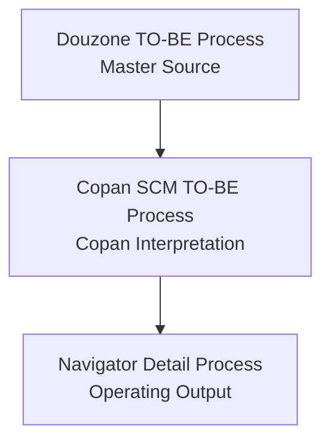

# Source Documents

|Field|Value|
|---|---|
|Title|Source Documents|
|Purpose|Navigator Process 작성 시 참조하는 원천 문서와 해석 문서의 보관 기준을 정의한다.|
|Status|Draft|
|Owner|Project Team|
|Last Updated|2026-06-28|
|Related Docs|`../02_Mapping/ProcessMapping.md`, `../../README.md`|

## Source Hierarchy

Navigator Process는 아래 신뢰 순서를 따른다.

## Folders

`Douzone`
: Douzone TO-BE PDF와 Douzone 기준 원천 프로세스 자료를 둔다. Navigator의 Master Source이다.

`Copan`
: Copan SCM TO-BE Process처럼 Douzone 원천을 Copan 운영 방식으로 해석한 자료를 둔다.

`Legacy`
: 과거 버전, 이전 산출물, 추적 목적의 참고 자료를 둔다.

## Current Source Files

현재 PDF 원본은 기존 링크 보존을 위해 `Docs/06_Data/Samples`에 남겨둔다. 다음 정리 Phase에서 PDF 이동 여부를 결정한다.

|sourceType|currentPath|role|
|---|---|---|
|Douzone Master Source|`Docs/06_Data/Samples/copan_to-be process by douzon.pdf`|Douzone TO-BE 전체 프로세스 기준 문서|
|Copan Interpretation|`Docs/06_Data/Samples/scm to-be process.pdf`|Copan SCM TO-BE 상세 프로세스 기준 문서|
|Copan Overview Reference|`Docs/06_Data/Samples/06. TO-BE overview.pdf`|Copan TO-BE Overview 기준 문서|
|Contract/Settlement Reference|`Docs/06_Data/Samples/계약 및 정산.pdf`|계약 및 정산 참고 문서|

## Usage Rule

새 Detail Process를 작성하기 전에는 반드시 아래 순서로 확인한다.

1. Douzone TO-BE PDF 확인
2. Copan SCM TO-BE Process 확인
3. 차이점 분석
4. Copan 운영 기준 반영
5. Navigator Process 작성

