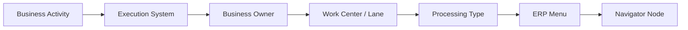
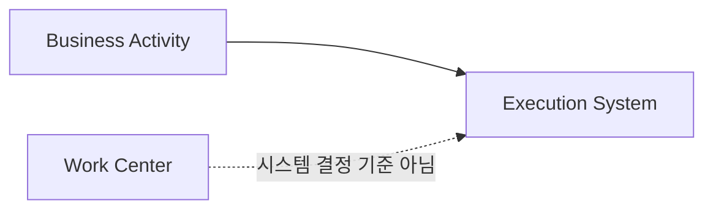
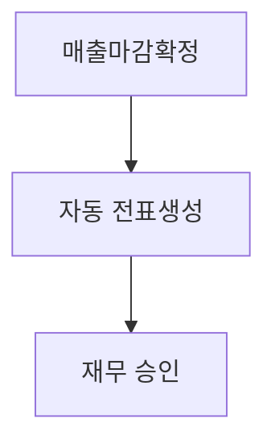
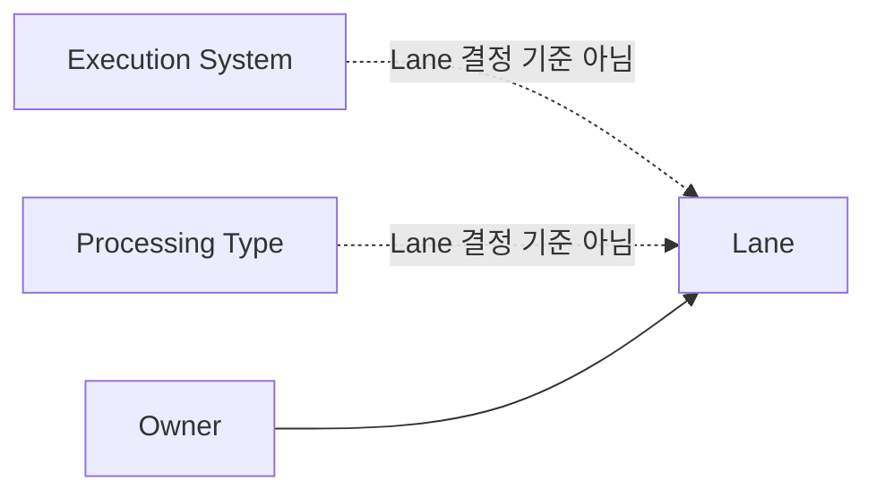
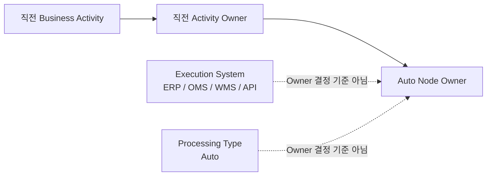
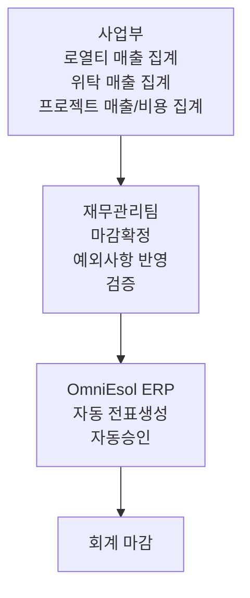
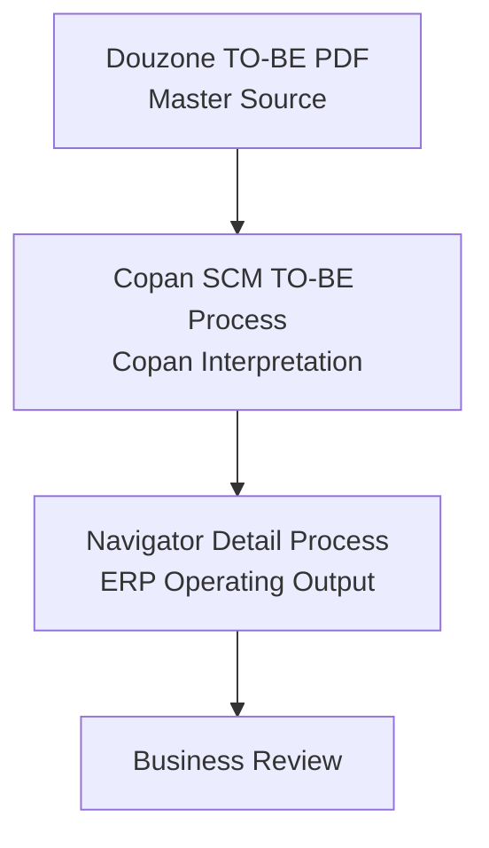

# Process Authoring Standard

|Field|Value|
|---|---|
|Title|Process Authoring Standard|
|Purpose|Copan ERP TO-BE Detail Process 작성 및 Audit 시 Node를 판단하는 기준을 정의한다.|
|Status|Approved|
|Owner|Project Team|
|Last Updated|2026-07-02|
|Related Docs|`ProcessMapping.md`, `../01_Source/README.md`, `../../02_Master/BusinessActivity.md`, `../../02_Master/SystemMappingMaster.md`|

> Methodology v1.0 Frozen. 변경은 Methodology Revision 결정이 있을 때만 수행한다.

## Purpose

Navigator Detail Process는 단순히 업무명을 나열하는 화면이 아니다.

각 Node는 아래 정보를 함께 가진 ERP 운영 기준 단위이다.

따라서 Node를 작성하거나 Audit할 때는 Node명 또는 Lane만 보고 판단하지 않는다.

## Node Composition

모든 Detail Process Node는 아래 5개 속성을 함께 검토한다.

|attribute|meaning|examples|
|---|---|---|
|Business Activity|현업 업무명|주문등록, 출고요청, 출고확정, 매출마감확정|
|Execution System|업무가 실제 수행되는 시스템|OmniEsol ERP, EasyAdmin OMS, EasyAdmin WMS, EasyChain, Cafe24, POS, Groupware|
|Processing Type|처리 방식|Manual, API, Auto|
|Owner|업무 책임 조직|사업부, 상생협력팀, 물류센터, 재무관리팀, 리테일사업부|
|ERP Menu|더존/ERP 기준 메뉴명|수주입력, 출고처리, 구매송장처리, 전표조회승인|

## Execution System Rule

Execution System은 Work Center 기준으로 일괄 결정하지 않는다.

Copan 운영에서는 동일한 Work Center 안에서도 Business Activity에 따라 사용하는 시스템이 달라진다. 따라서 Execution System은 반드시 Business Activity 기준으로 정의한다.

|wrong basis|correct basis|
|---|---|
|판매현장 기준으로 EasyChain을 일괄 적용|현장 판매 Activity = EasyChain|
|판매현장 기준으로 ERP를 일괄 적용|재고이동 요청 Activity = OmniEsol ERP|
|온라인팀 기준으로 Cafe24를 일괄 적용|주문접수 = Cafe24, 주문수집 = EasyAdmin OMS, 출고 = EasyAdmin WMS, 매출마감 = OmniEsol ERP|

Work Center는 업무 수행 조직 또는 수행 영역을 표현한다.

Execution System은 해당 Activity가 실제로 어느 시스템에서 발생하는지를 표현한다.

### Work Center Example: 판매현장

|Business Owner|Work Center|Business Activity|Execution System|Processing Type|
|---|---|---|---|---|
|사업부|판매현장|재고이동 요청|OmniEsol ERP|Manual|
|사업부|판매현장|출고 처리|EasyAdmin WMS|Manual / Auto|
|사업부|판매현장|현장 판매|EasyChain|Manual|
|사업부|판매현장|매출마감|OmniEsol ERP|Manual|

### Online Operation Example

|Business Activity|Execution System|
|---|---|
|주문접수|Cafe24|
|주문수집|EasyAdmin OMS|
|출고|EasyAdmin WMS|
|매출마감|OmniEsol ERP|

Navigator는 조직별 고정 시스템을 표현하는 것이 아니라, Activity별 시스템 흐름을 표현한다.

## Node Separation Rule

같은 업무명이라도 Execution System이 다르면 다른 Node로 작성한다.

예시:

|Business Activity|Execution System|Owner|meaning|
|---|---|---|---|
|출고처리|EasyAdmin WMS|물류센터|실제 물류 출고 처리|
|출고처리|OmniEsol ERP|사업부 또는 재무관리팀|ERP 재고/회계 반영 처리|

이 두 Node는 같은 이름처럼 보이더라도 하나로 합치지 않는다.

## Node Number Authoring Rule

Detail Process의 Node Number는 작성자가 JSON에 저장하는 값이 아니다.

Navigator는 기존 수동 `stepBadge` 값을 화면 표시 기준으로 사용하지 않는다. `stepBadge`는 legacy field로 남아 있을 수 있으나 신규 작성, Audit, Review 기준으로 사용하지 않는다.

Node Number는 현재 Process의 Flow Execution Order를 기준으로 렌더링 시 자동 계산되는 view-only 값이다.

### Purpose

Node Number는 Builder와 Viewer가 업무 흐름을 읽는 데 도움을 주는 보조 표시이다.

Node Number는 아래 항목을 대체하지 않는다.

- Business Activity
- Execution System
- Business Owner
- Work Center / Lane
- Processing Type
- ERP Menu
- Review 승인 기준

### Number Display Target

아래 Node는 번호 표시 대상이다.

|target|authoring rule|
|---|---|
|Manual 업무 Node|사람이 직접 수행하는 입력, 확인, 판단, 승인 업무는 번호 표시 대상이다.|
|ERP / OMS / WMS / POS 업무 Node|OmniEsol ERP, EasyAdmin OMS/WMS, EasyChain/POS 등에서 사람이 등록, 확인, 확정하는 업무 Node는 번호 표시 대상이다.|
|Approval / Decision Node|업무 의사결정, 승인/반려, Y/N 판단처럼 현업 판단 성격이 있는 Node는 번호 표시 대상이다.|

### Number Display Exclusion

아래 Node는 번호 표시 대상에서 제외한다.

|target|authoring rule|
|---|---|
|database|재고현황, 출고정보, 입고정보 등 정보/상태 Node는 번호를 표시하지 않는다.|
|linked-process|다른 상세 Process로 이어지는 참조 Node는 번호를 표시하지 않는다.|
|api / interface|시스템 연동 또는 데이터 전달 Node는 번호를 표시하지 않는다.|
|interface-rule / system-rule|시스템 내부 판단 또는 연동 규칙 Node는 번호를 표시하지 않는다.|
|connector / phase-connector / merge|흐름 보조 또는 Layout helper Node는 번호를 표시하지 않는다.|
|auto-only node|전표생성(미결), 자동승인, 자동 상태변경처럼 사람이 직접 수행하지 않는 Auto Node는 번호를 표시하지 않는다.|

### Builder and Viewer Rule

Builder Detail 화면에서는 번호 표시를 ON/OFF 할 수 있다.

Viewer 화면에서는 향후 기본 ON을 검토하되, 복잡한 분기 Process는 Review 후 표시 정책을 결정한다.

### Flow Execution Order Rule

번호는 사람이 실제 업무를 수행하는 순서를 표현한다.

기본 기준은 Edge 흐름이다.

번호 제외 Node는 traversal에는 포함하지만 번호를 부여하지 않는다.

여러 start node가 있으면 `detailLayout column / row`, `cellOrder / cellSlot`, `node id` 기준으로 start 우선순위를 정한다.

한 Node에서 여러 outgoing edge가 있으면 아래 순서로 실행 우선순위를 정한다.

1. Main, Y, 정상, 기본, 승인 흐름
2. 일반 흐름
3. N, 반려, 예외, 보완, 재작업 흐름
4. return / feedback 흐름

분기 흐름은 단순 연속번호가 아니라 `6A`, `6B` 같은 branch 번호를 사용할 수 있다.

합류 Node는 분기 이후 공통 후속 단계로 번호를 부여한다.

루프/반려 edge는 실행 순번을 역행시키지 않도록 별도 처리한다.

업무적 우선순위가 필요한 경우 수동 번호를 입력하지 않는다. Flow Label, Edge Label, Process 구조 보정으로 해결한다.

## B2C Online Flow Standard

B2C 온라인 주문 흐름은 아래 기준으로 해석한다.

따라서 B2C Process에서는 주문, 물류, ERP, 재무 단계를 업무명만으로 병합하지 않는다.

각 단계는 Business Activity별 Execution System과 Owner를 기준으로 분리한다.

## Sales Posting Standard

매출 처리는 아래 기준으로 표현한다.

`전표생성(미결)`은 사람이 직접 수행하는 업무처럼 표현하지 않는다.

자동 생성 단계와 재무 승인 단계를 분리한다.

다만 자동 생성 Node라고 해서 Lane이 재무관리팀으로 이동하는 것은 아니다.

예를 들어 사업부가 `매출마감확정`을 수행하고 OmniEsol ERP가 자동으로 `전표생성(미결)`을 수행하는 경우, `전표생성(미결)` Node의 기준은 아래와 같다.

|attribute|value|
|---|---|
|Business Activity|전표생성(미결)|
|Execution System|OmniEsol ERP|
|Processing Type|Auto|
|Owner|사업부|
|Lane|사업부|

재무관리팀 업무는 `전표조회승인`부터 시작한다.

## Lane Rule

Lane은 담당 조직 기준으로만 작성한다.

시스템 기준으로 Lane을 바꾸지 않는다.

Processing Type이 `Auto`인 것도 Lane을 결정하지 않는다.

Lane은 항상 Owner를 표현한다.

|wrong basis|correct basis|
|---|---|
|ERP Lane|사업부 / 재무관리팀 등 Owner Lane|
|EasyAdmin Lane|물류센터 등 Owner Lane|
|POS/EasyChain Lane|리테일사업부 또는 매장 담당 조직 Lane|

시스템은 Lane이 아니라 Execution System 속성으로 표현한다.

## Execution System Is Not Owner

Execution System과 Owner는 다르다.

|Node|Execution System|Processing Type|Owner|Lane|
|---|---|---|---|---|
|전표생성(미결)|OmniEsol ERP|Auto|사업부|사업부|
|ERP 자동 재고반영|OmniEsol ERP|Auto|해당 업무 책임 조직|해당 업무 책임 조직|
|ERP 자동 상태변경|OmniEsol ERP|Auto|해당 업무 책임 조직|해당 업무 책임 조직|
|전표조회승인|OmniEsol ERP|Manual|재무관리팀|재무관리팀|

따라서 Execution System이 ERP라는 이유만으로 재무관리팀 Lane으로 이동하지 않는다.

## Auto Node Owner Rule

Auto Node의 Owner는 Execution System으로 결정하지 않는다.

Execution System은 "어디에서 수행되는가"를 의미하고, Owner는 "누가 책임지는 업무인가"를 의미한다.

따라서 Auto Node의 Owner는 자동 처리를 발생시킨 직전 Business Activity의 Owner를 따른다.

### Rule 1. 사업부 업무에서 발생한 Auto

사업부가 `매출마감확정`을 수행한 뒤 OmniEsol ERP가 자동으로 `전표생성(미결)`을 수행하는 경우, 자동 전표 Node의 Owner는 사업부이다.

|attribute|value|
|---|---|
|Business Activity|전표생성(미결)|
|직전 Business Activity|매출마감확정|
|직전 Activity Owner|사업부|
|Execution System|OmniEsol ERP|
|Processing Type|Auto|
|Owner|사업부|
|Lane|사업부|

이 경우 전표생성은 재무관리팀 업무가 아니다.

재무관리팀 업무는 `전표조회승인`부터 시작한다.

### Rule 2. 재무 업무에서 발생한 Auto

재무관리팀이 `정산마감확정`, `예외사항 반영`, `검증`을 수행한 뒤 OmniEsol ERP가 자동으로 전표를 생성하는 경우, 자동 전표 Node의 Owner는 재무관리팀이다.

|attribute|value|
|---|---|
|Business Activity|전표생성|
|직전 Business Activity|정산마감확정 / 예외사항 반영 / 검증|
|직전 Activity Owner|재무관리팀|
|Execution System|OmniEsol ERP|
|Processing Type|Auto|
|Owner|재무관리팀|
|Lane|재무관리팀|

이 경우 전표생성은 재무관리팀 마감확정 결과로 발생한 Auto이다.

## Settlement Process Rule

정산 Process는 아래 기준으로 작성한다.

정산에서 `집계`는 사업부 Owner이다.

정산에서 `확정`, `예외사항 반영`, `검증`은 재무관리팀 Owner이다.

정산 전표생성은 ERP 자동 처리이지만, Owner는 직전 `마감확정`을 수행한 재무관리팀이다.

즉, 정산 Process의 자동 전표생성은 일반 매출 Process의 자동 전표생성과 Owner가 다를 수 있다.

## Audit Order

Detail Process Audit은 아래 순서로 수행한다.

1. Business Activity가 현업 업무명으로 이해 가능한가
2. Execution System이 해당 Business Activity 기준으로 맞는가
3. Business Owner가 업무 책임 조직 기준으로 맞는가
4. Work Center 또는 Lane이 업무 수행 조직/영역 기준으로 맞는가
5. Processing Type이 Manual/API/Auto 중 무엇인지 명확한가
6. ERP Menu가 Douzone Master Source와 추적 가능한가
7. Auto Node라면 직전 Business Activity가 무엇인가
8. Edge 흐름이 시스템 간 이동과 업무 책임 전환을 구분하는가

## Batch Correction Rule

04~20 Detail Process 보정 시 기존 `laneId`만 보고 수정하지 않는다.

아래 정보를 함께 확인한 뒤 보정한다.

|check|question|
|---|---|
|Business Activity|이 Node는 현업이 어떤 업무로 이해해야 하는가?|
|Execution System|이 Activity는 실제 어떤 시스템에서 발생하는가? Work Center 기준으로 일괄 추정하지 않았는가?|
|Processing Type|사람 작업인가, API인가, 자동인가?|
|Owner|누가 업무 책임을 가지는가?|
|Lane|Lane이 Owner 기준으로 유지되어 있는가?|
|ERP Menu|Douzone 기준 메뉴와 어떻게 연결되는가?|

자동 생성 Node는 반드시 Owner를 다시 확인한다. `전표생성(미결)`, ERP 자동 재고반영, ERP 자동 상태변경은 Execution System이 ERP라는 이유만으로 재무관리팀 Lane에 배치하지 않는다.

Auto Node를 검토할 때는 아래 순서로 판단한다.

1. Business Activity
2. 직전 Business Activity
3. 직전 Activity Owner
4. Execution System
5. Processing Type
6. Lane

이 Rule은 전표생성, 재고반영, 상태변경, API 처리, 자동 인터페이스, 자동 정산, 자동 승인에 동일하게 적용한다.

## Practical Examples

|case|authoring decision|
|---|---|
|출고요청이 사업부에서 발생하고 WMS 출고로 이어짐|출고요청 Node는 Owner=사업부, Execution System=OmniEsol ERP 또는 업무 기준 시스템으로 유지하고, 이후 WMS Node를 별도 작성한다.|
|출고확정이 EasyAdmin WMS에서 발생하고 ERP 재고(-)가 생성됨|WMS 출고확정 Node와 ERP 재고 반영 Node를 분리한다.|
|매출마감확정 후 전표가 생성됨|매출마감확정, 자동 전표생성(미결), 재무 전표조회승인 Node를 분리한다. 자동 전표생성(미결)의 Lane은 매출마감 업무 Owner 기준으로 둔다.|
|정산마감확정 후 전표가 생성됨|집계는 사업부 Owner, 마감확정/검증은 재무관리팀 Owner로 둔다. 자동 정산전표 생성은 직전 재무 마감확정의 Owner를 따라 재무관리팀 Lane에 둔다.|
|POS 매장 판매가 ERP 매출로 이어짐|POS/EasyChain 판매 Node와 OmniEsol ERP 매출 Node를 분리한다.|

## Current Principle

Copan ERP TO-BE Process는 아래 관계를 유지한다.

Navigator는 Douzone 메뉴를 그대로 복사하는 문서가 아니라 Copan 운영 기준으로 재구성한 ERP 운영 산출물이다.
