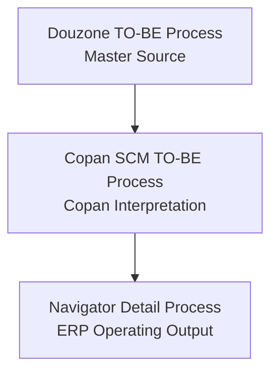

# Process Mapping

|Field|Value|
|---|---|
|Title|Navigator Process Mapping|
|Purpose|21개 Detail Process를 Douzone Master Source, Copan SCM TO-BE Process, Navigator 결과물 기준으로 연결한다.|
|Status|Approved|
|Owner|Project Team|
|Last Updated|2026-06-29|
|Related Docs|`DouzoneProcessCoverage.md`, `ProcessAuthoringStandard.md`, `../01_Source/README.md`, `../../04_Audit/Process/scm-to-be-process-node-order.md`|

> Methodology v1.0 Frozen. 변경은 Methodology Revision 결정이 있을 때만 수행한다.

## Purpose

Navigator는 단순 프로세스 편집기가 아니라 ERP 구축 공식 산출물이다.

따라서 모든 Detail Process는 아래 관계를 유지한다.



## Source Documents

|sourceType|document|currentPath|version/date|role|
|---|---|---|---|---|
|Douzone Master Source|Copan TO-BE Process by Douzone|`Docs/06_Data/Samples/copan_to-be process by douzon.pdf`|2026-06-27 PDF metadata / 중간보고서 V1.0 2026-05-15|Master Source|
|Copan Interpretation|SCM TO-BE Process|`Docs/06_Data/Samples/scm to-be process.pdf`|2026-06-15 PDF metadata / v1.0|Copan Interpretation|
|Navigator Reference|SCM TO-BE Process Group Node Order|`Docs/04_Audit/Process/scm-to-be-process-node-order.md`|Draft|Navigator detail group seed|

## Authoring and Audit Standard

Detail Process 작성 및 Audit은 `ProcessAuthoringStandard.md`를 기준으로 한다.

특히 Node는 아래 순서로 검토한다.

1. Business Activity
2. Execution System
3. Business Owner
4. Work Center / Lane
5. Processing Type
6. ERP Menu

Lane은 담당 조직, 즉 Owner 기준으로 작성하며, 시스템은 Execution System 속성으로 표현한다.

`Auto` 처리 Node도 Lane을 결정하지 않는다. `전표생성(미결)`, ERP 자동 재고반영, ERP 자동 상태변경은 Execution System이 ERP라는 이유만으로 재무관리팀 Lane에 배치하지 않는다.

## Process Metadata Template

모든 Detail Process는 향후 UI 또는 data schema에 아래 metadata를 가질 수 있어야 한다. 이번 Phase에서는 문서 기준만 정의한다.

```yaml
reference:
  sourceDocument: ""
  sourceProcess: ""
  sourcePage: ""
  douzoneVersion: ""
copan:
  modified: "Y/N"
  modificationReason: ""
  owner: ""
  reviewStatus: "Draft / In Review / Approved / Deferred"
```

## 20 Detail Process Mapping Draft

|No|Navigator Detail Process|detailProcessId|Navigator Source Page|Douzone Source Process|Douzone Page|Copan Change|Modification Reason|Owner|Review Status|
|---|---|---|---|---|---|---|---|---|---|
|01|사업 기회 확보 ~ 구매 요청 : 제/상품|`business-to-purchase-request`|SCM PDF p.2|품목 등록 PROCESS / 거래처 등록 PROCESS / 계약 등록 PROCESS / 구매 입고 PROCESS|Douzone PDF pp.46, 48, 51-53|Y|사업기회, 사업참여검토, 계약등록, 사업계약품의, 프로젝트등록, WBS, 프로젝트 상태관리, 품목/거래처 기준정보, 구매요청을 SCM Lifecycle 시작점으로 정리한다.|사업부 / 상생협력팀|Internal Review Ready|
|02|구매 요청 ~ 입고 ~ 매입 전표 : 제/상품|`purchase-to-ap-invoice`|SCM PDF p.3|구매 입고 PROCESS|Douzone PDF p.53|Y|계약/프로젝트 기반 구매요청, 구매발주, EasyAdmin WMS 입고, ERP 재고(+), 매입마감, 전표생성(미결), 재무 전표조회승인을 Owner 기준으로 정리한다.|사업부 / 상생협력팀 / 물류센터 / 재무관리팀|Internal Review Ready|
|03|주문 등록 ~ 출고 ~ 매출 전표 : B2B 국내|`b2b-domestic-order-to-sales`|SCM PDF p.5|국내 B2B 판매 PROCESS|Douzone PDF p.62|Y|EasyAdmin/WMS 출고 처리, 위탁 여부, 재고(-), 매출마감/전표 흐름을 반영한다.|사업부 / 물류센터 / 재무관리팀|Draft|
|04|주문 반품 ~ 입고 ~ 반품 전표 : B2B 국내|`b2b-domestic-return`|SCM PDF p.6|B2B 판매 반품 PROCESS|Douzone PDF p.63|Y|반품 입고, 위탁 여부, 재고(+), 반품 매출마감/전표 흐름을 반영한다.|사업부 / 물류센터 / 재무관리팀|Draft|
|05|주문 등록 ~ 수출 출고 ~ 매출 전표 : B2B 해외|`b2b-export-order-to-sales`|SCM PDF p.7|자사 재고 해외 B2B PROCESS / 위탁 재고 해외 B2B PROCESS|Douzone PDF pp.64-65|Y|자사/위탁 해외 B2B 수주, 수출 이동지시, 송장입력, 수출통관처리, B/L 입력, 해외 가상창고 재고이동, 매출마감, 전표생성(미결), 전표조회승인을 Owner 기준으로 정리한다.|사업부 / 물류센터 / 재무관리팀|In Review|
|06|주문 등록 ~ 출고 ~ 매출 전표 : B2C|`b2c-order-to-sales`|SCM PDF p.8|B2C 판매 PROCESS|Douzone PDF p.60|Y|Cafe24 온라인 주문, EasyAdmin OMS 주문수집, EasyAdmin WMS 출고, OmniEsol ERP 주문등록/매출마감, 전표생성(미결), 재무 전표조회승인을 Owner 기준으로 정리한다.|사업부 / 물류센터 / 재무관리팀|Internal Review Ready|
|07|예약 판매 ~ 출고 ~ 매출전표 : B2C|`preorder-to-sales`|SCM PDF p.9|B2C 판매 PROCESS|Douzone PDF p.60|Y|예약판매, PG 정산, EasyAdmin OMS/WMS 출고, 선수금 처리/반제, 매출마감, 전표생성(미결), 재무 전표조회승인을 Owner 기준으로 정리한다.|사업부 / 물류센터 / 재무관리팀|Internal Review Ready|
|08|주문 반품 ~ 입고 ~ 반품전표 : B2C|`b2c-return`|SCM PDF p.10|B2C 판매 반품 PROCESS|Douzone PDF p.61|Y|온라인몰 반품요청, EasyAdmin OMS 반품주문수집, EasyAdmin WMS 반품입고, ERP 재고(+), 반품마감, 전표생성(미결), 재무 승인을 Owner 기준으로 정리한다.|사업부 / 물류센터 / 재무관리팀|Internal Review Ready|
|09|공연장/팝업 판매 ~ 출고 ~ 매출전표 : 제/상품|`popup-concert-stock-sales-sync`|SCM PDF p.11|공연장(행사장) 팝업 PROCESS|Douzone PDF p.68|Y|공연장 출고, 현장 판매, 잔여재고 복귀, 매출마감, 전표생성(미결), 재무 전표조회승인을 Owner 기준으로 정리한다.|사업부 / 물류센터 / 판매현장 / 재무관리팀|Internal Review Ready|
|10|이벤트 : 제/상품|`event-sales`|SCM PDF p.12|이벤트 PROCESS|Douzone PDF p.69|Y|Cafe24 이벤트 주문, 당첨자 여부, 현장수령/택배발송 분리, EasyAdmin 출고, 전표생성(미결), 재무 전표조회승인을 Copan 운영 기준으로 정리한다.|사업부 / 물류센터 / 판매현장 / 재무관리팀|Internal Review Ready|
|11|매장 판매 ~ 출고 ~ 매출전표 : 제/상품|`store-sales`|SCM PDF p.13|매장 출고 PROCESS|Douzone PDF p.70|Y|POS/EasyChain 매출연동, ERP 주문/출고, ERP 재고(-), 매출마감, 전표생성(미결), 재무 전표조회승인을 Owner 기준으로 정리한다.|판매현장 / 재무관리팀|Internal Review Ready|
|12|매장 간 재고이동 : 제/상품|`stock-transfer`|SCM PDF p.14|매장 재고이동 PROCESS / 재고이동 PROCESS|Douzone PDF pp.73-74|Y|POS 재고이동 확정 API와 ERP 입/출고정보를 함께 반영한다.|사업부 / 물류센터|Draft|
|13|기타 출고 : 제/상품|`other-issue`|SCM PDF p.15|기타 출고 PROCESS|Douzone PDF pp.71, 75|Y|무상 증정품 사용품의, 위탁 여부, EasyAdmin 출고확정 흐름을 반영한다.|사업부 / 물류센터|Draft|
|14|기획사 로열티 정산 : 제/상품|`royalty-mg-settlement`|SCM PDF p.16|판매 로열티 정산 PROCESS|Douzone PDF p.77|Y|사업부 로열티 매출 집계, 재무 마감확정, MG 차감 여부, 정산마감, ERP 자동 전표생성/자동승인을 Copan 정산 기준으로 정리한다.|사업부 / 재무관리팀|Internal Review Ready|
|15|위탁 매출 정산|`consignment-settlement`|SCM PDF p.17|위탁 매출 정산 PROCESS|Douzone PDF p.76|Y|사업부 위탁 매출 집계, 재무 마감확정, 예외처리, 정산마감, ERP 자동 전표생성/자동승인을 Copan 위탁정산 기준으로 정리한다.|사업부 / 재무관리팀|Internal Review Ready|
|16|수익배분 매출 정산|`revenue-share-settlement`|SCM PDF p.18|위탁 매출 정산 PROCESS / 판매 로열티 정산 PROCESS|Douzone PDF pp.76-77|Y|수익배분 계약 기준 매출/비용 집계, 재무 마감확정, MG 차감, 정산마감, ERP 자동 전표생성/자동승인을 정리한다.|사업부 / 재무관리팀|Internal Review Ready|
|17|사업기회 ~ 비용 전표 생성 : 서비스|`service-business-to-expense`|SCM PDF p.19|계약 등록 PROCESS / 비용청구관리|Douzone PDF pp.51-52, 9-10|Y|서비스 사업은 구매/재고보다 계약, 프로젝트, 지출결의, 비용전표 중심으로 운영한다.|사업부 / 재무관리팀|Draft|
|18|구매 요청 ~ 매입 전표 생성 : 서비스|`service-purchase-to-ap`|SCM PDF p.20|구매 입고 PROCESS|Douzone PDF p.53|Y|서비스 구매는 물류 입고 대신 부분권한/검수 기준 입고확정, 매입마감, 전표생성(미결), 재무 전표조회승인으로 정리한다.|사업부 / 상생협력팀 / 재무관리팀|Internal Review Ready|
|19|주문 등록 ~ 매출 전표 생성 : 서비스|`service-order-to-sales`|SCM PDF p.21|플랫폼 비재고 매출 PROCESS / 콘텐츠 비재고 매출 PROCESS|Douzone PDF pp.66-67|Y|서비스 매출은 재고 출고 대신 서비스 제공 확인, 매출마감확정, 전표생성(미결) 중심으로 구성한다.|사업부 / 재무관리팀|In Review|
|20|프로젝트 정산 : 서비스|`service-project-settlement`|SCM PDF p.22|위탁 매출 정산 PROCESS / 판매 로열티 정산 PROCESS|Douzone PDF pp.76-77|Y|서비스 프로젝트 매출/비용 집계, 재무 마감확정, MG 차감, 정산마감, ERP 자동 전표생성/자동승인을 정리한다.|사업부 / 재무관리팀|Internal Review Ready|

## Difference List: Copan SCM TO-BE vs Douzone TO-BE

|category|difference|affectedProcesses|reason|
|---|---|---|---|
|External System|EasyAdmin/WMS/OMS 연동이 명시된다.|02-11, 14|Copan 물류/주문 운영은 ERP 단독이 아니라 EasyAdmin/WMS/OMS와 연동된다.|
|Sales Channel|Cafe24, POS/이지체인, PG, 현장판매 등 채널별 흐름이 분리된다.|07-13|실제 주문 수집/결제/판매 발생 시스템이 채널별로 다르다.|
|Consignment|위탁 여부와 위탁재고 현황이 반복 판단/조회로 등장한다.|02-17|자사재고와 위탁재고 회계/재고 처리가 다르다.|
|Inventory API|재고(+), 재고(-), 입/출고정보, 출고정보 DB가 별도 표시된다.|02-14|ERP 재고와 외부 물류 시스템 간 수량 동기화가 핵심 통제 지점이다.|
|Settlement|매출/비용 집계, MG 차감, 정산마감, 전표생성(미결)이 Copan 정산 기준으로 확장된다.|15-17, 21|기획사/위탁/수익배분 계약 구조를 반영한다.|
|Prepayment|예약판매에서 선수금 처리/반제 흐름이 추가된다.|08|배송 완료 후 선수금 대상 리스트와 실제 출고/매출 대사가 필요하다.|
|Event Operation|이벤트 주문에서 당첨자, 현장수령, 택배발송 분기가 추가된다.|11|현장 운영과 택배 운영을 별도 관리해야 한다.|
|Service Business|서비스 프로세스는 재고 흐름보다 계약/프로젝트/비용/매출/정산 중심으로 재구성된다.|18-21|서비스 사업은 제/상품 재고 기반 프로세스와 운영 기준이 다르다.|

## Per-Process Copan Change Template

새 Detail Process 검토 시 아래 템플릿을 복사해 사용한다.

```md
### Process NN. <Navigator Process Name>

|Field|Value|
|---|---|
|detailProcessId||
|Source Document||
|Source Process||
|Source Page||
|Douzone Version||
|SCM TO-BE Page||
|Modified (Y/N)||
|Modification Reason||
|Owner||
|Review Status|Draft|

#### Douzone Baseline

- 

#### Copan Interpretation

- 

#### Navigator Implementation Notes

- 

#### Open Questions

- 
```

## Next Use

1. 21개 Detail Process를 Navigator에서 열고 현재 구현 상태를 이 Mapping Table과 대조한다.
2. 각 Process별 누락 노드/연결선/구역/시스템명을 `Review Status = In Review`로 표시한다.
3. 현업 검토가 끝난 Process만 `Approved`로 올린다.
