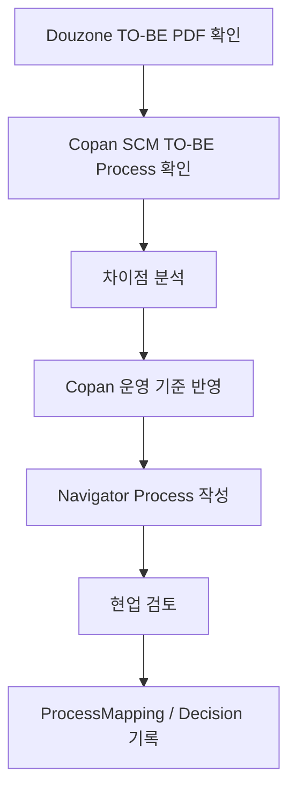
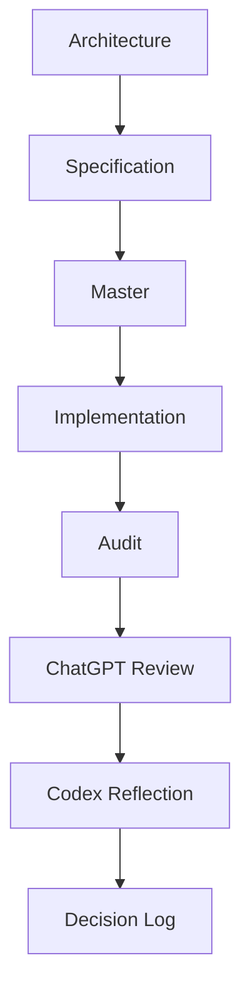
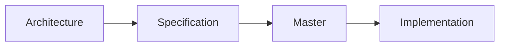

# Copan SCM Navigator Documentation Hub

|Field|Value|
|---|---|
|Title|Documentation Hub|
|Purpose|Copan SCM Navigator의 운영 철학, Process Asset 기준, 문서 작성 기준을 정의한다.|
|Status|Approved|
|Owner|Project Team|
|Last Updated|2026-06-30|
|Related Docs|`00_Project/Roadmap.md`, `01_Architecture/Architecture.md`, `01_Architecture/RoleBasedAccessControl.md`, `01_Architecture/LocalDevelopment.md`, `01_Architecture/LocalStorage.md`, `01_Architecture/TemplatePackage.md`, `02_Master/ProcessDefinition.md`|

## Navigator Mission

Navigator는 Copan의 SCM 업무를 업무 흐름(Process), 책임 조직(Business Owner), 업무 수행 영역(Work Center), 실행 시스템(Execution System), ERP 메뉴(ERP Menu)까지 하나의 흐름으로 연결하여 설명하는 Enterprise Process Asset Repository이다.

Navigator는 ERP 기능을 설명하는 시스템이 아니라, Copan의 업무가 어떻게 수행되는지를 표준화하고 공유하는 업무 매뉴얼이다.

## Core Principles

### 1. Process First

업무(Process)가 ERP보다 우선한다.

ERP는 업무를 수행하기 위한 도구이다.

### 2. Douzone Is Master Source

Douzone TO-BE는 Master Source이다.

Navigator는 Douzone TO-BE를 원천으로 사용하되, Copan 운영 기준으로 재구성한다.

### 3. Copan Standard

더존 표준을 그대로 구현하는 것이 목적이 아니다.

Navigator는 Copan의 실제 운영 기준을 표준 업무로 구축한다.

### 4. Role Based Access

Navigator의 권한은 사용자 이름이 아니라 Role 기준으로 적용한다.

기본 Role은 다음과 같다.

- Platform Owner
- Process Builder
- Viewer

Google Workspace 로그인은 사용자를 식별하는 수단이며, 실제 기능 권한은 Email에 매핑된 Role로 결정한다.

### 5. Lifecycle First

좌측 메뉴는 ERP 모듈이 아니라 SCM 업무 Lifecycle 기준으로 구성한다.

```text
사업 시작
↓
기준정보
↓
구매/입고
↓
판매
↓
반품
↓
재고
↓
정산
```

### 6. ERP Menu Is Metadata

ERP 메뉴는 Process Group의 기준이 아니다.

ERP 메뉴는 Node의 Metadata이며, Process는 업무 기준으로 구성한다.

### 7. Enterprise Knowledge

Navigator는 단순 Process Map이 아니다.

Navigator는 Copan의 업무 지식을 축적하고 공유하는 Enterprise Process Asset Repository이다.

## Left Menu Principle

좌측 메뉴는 더존 모듈명 또는 ERP 기능 기준으로 구성하지 않는다.

좌측 메뉴는 Copan SCM Lifecycle 기준으로 구성한다.

Viewer는 "ERP에서 어떤 메뉴를 눌러야 하는가"보다 "내 업무가 어떤 흐름으로 진행되는가"를 먼저 이해할 수 있어야 한다.

현재 Process Group은 다음 Lifecycle 기준으로 재구성한다.

1. 사업 시작
2. 기준정보
3. 구매/입고
4. 판매
5. 반품
6. 재고
7. 정산

## Process Authoring Principle

모든 Process는 아래 순서로 설계한다.

1. Business Activity
2. Execution System
3. Business Owner
4. Work Center
5. Processing Type
6. ERP Menu

Execution System은 Business Activity 기준으로 결정한다.

Business Owner와 Work Center는 구분한다.

ERP Menu는 Process를 설명하기 위한 보조 정보, 즉 Metadata로 관리한다.

## 프로젝트 개요

이 프로젝트의 현재 운영 목적은 Copan SCM Navigator를 Enterprise Process Asset Repository로 구축하는 것이다.

Platform 구조는 장기적으로 Universal Process Modeling Platform을 지향하지만, 현재 우선순위는 Copan SCM Process Asset 구축이다.

목적은 두 가지다.

1. Universal Process Modeling Platform
   - 특정 회사에 종속되지 않는 범용 프로세스 모델링 플랫폼
   - ERP, SCM, 제조, 물류, 회계, 공공, 서비스 프로세스에 재사용 가능
   - Node, Edge, Lane, Zone, Canvas, Editor, Layout Engine, Routing Engine, Diagnostics, Import / Export Framework를 범용 구조로 유지

2. Copan SCM Process Asset Template
   - Universal Process Platform 위에서 동작하는 첫 번째 Template
   - Copan의 SCM 관련 계약, 프로젝트, 구매, 입고, 출고, 재고, 반품, 정산, 플랫폼, 이벤트, 매장/POS 흐름을 Template Data로 관리
   - Copan은 Platform이 아니라 Template이다

현재 목표:

- Copan SCM Process Asset을 Navigator 안에서 ERP 구축 공식 산출물 수준으로 완성
- Douzone SCM TO-BE Process를 Master Source로 관리
- Copan SCM TO-BE Process를 Copan Interpretation으로 관리
- Navigator Detail Process를 Copan 운영 기준서로 관리
- Platform 개선은 Copan Process 작성 중 실제 불편이 발생할 때만 진행

현재 구축 제외/Reference Only:

- 공통관리, 조직관리, 인사관리, 회계관리, 세무관리
- 위 영역은 Navigator 구축 대상이 아니며 OmniEsol ERP 교육과 실제 사용으로 정착
- Navigator에서는 SCM 프로세스와 연결되는 ERP 메뉴, 승인 지점, 교육 필요 사항만 Reference Only로 관리

현재 제외 범위:

- Firebase
- AWS
- Hosting
- Authentication
- Firestore
- Cloud Storage
- Cloud Database
- Google Workspace Login
- Deployment
- Multi User
- Collaboration

최근 변경:

- Docs 구조를 공식 Documentation Architecture로 재구성
- Architecture 기준을 Universal Process Modeling Platform 중심으로 재정의
- Workspace Runtime, Template Runtime, Storage Adapter 역할을 Architecture 문서에 반영
- Copan ERP를 Platform이 아니라 Template으로 명확히 분리
- Copan ERP TO-BE Process 완성을 1순위로 재조정
- `06_Data/01_Source`와 `06_Data/02_Mapping/ProcessMapping.md`를 추가하여 Master Source 추적 기준 정의
- SCM Process 구축 Methodology를 v1.0으로 고정하고 Frozen 상태로 전환
- Detail Process Node Number는 저장값이 아니라 Flow Execution Order 기준으로 렌더링 시 계산되는 view-only 값으로 정리

## Methodology v1.0

현재 SCM Process 구축은 Methodology v1.0을 공식 기준으로 사용한다.

Methodology v1.0 구성 문서는 다음과 같다.

- `02_Master/BusinessCapabilityMaster.md`
- `02_Master/BusinessActivityMaster.md`
- `02_Master/NodeDefinitionStandard.md`
- `06_Data/02_Mapping/ProcessAuthoringStandard.md`
- `06_Data/02_Mapping/ProcessMapping.md`
- `06_Data/02_Mapping/DouzoneProcessCoverage.md`
- `06_Data/02_Mapping/SCMProcessNumbering.md`

Methodology는 Frozen 상태이며, 이후 SCM Process 구축은 이 기준을 따른다.

Methodology 변경은 아래 경우에만 별도 Methodology Revision으로 관리한다.

1. Douzone Master Source와 충돌
2. Copan 실제 운영과 충돌
3. 혁신팀 내부 Review에서 변경 필요 결정

그 외에는 새로운 Rule, 새로운 Master, 새로운 Methodology 문서를 만들지 않는다.

## 문서 구조

`00_Project`
: 프로젝트의 목표, 범위, 로드맵, 의사결정 기록을 관리합니다.

`01_Architecture`
: 프로젝트의 공식 설계 기준입니다. 코드보다 높은 우선순위를 가지며, 승인 후 변경합니다.

핵심 문서:

- `Architecture.md`: 전체 계층 기준
- `Layer.md`: Platform / Workspace Runtime / Template Runtime 책임
- `DataModel.md`: Template Data와 Platform Data 관계
- `Generator.md`: Template Runtime 기반 Generator 책임
- `LocalDevelopment.md`: 현재 로컬 개발 범위
- `LocalStorage.md`: Local Storage Adapter 기준
- `TemplatePackage.md`: Template import/export package 기준
- `RoleBasedAccessControl.md`: Role 기반 권한 모델 기준

`02_Master`
: Node, Edge, Lane, Zone, Layout Rule, Process Definition 등 프로젝트 표준 Master를 정의합니다.

`03_Guides`
: 사용자, 편집자, 개발자, Generator 작성자를 위한 실행 가이드입니다.

`04_Audit`
: 현재 상태를 사실 중심으로 기록합니다. 수정 의견이나 설계 판단은 포함하지 않습니다.

`05_Review`
: ChatGPT, Codex, 개발자 검토 의견을 기록합니다. Review는 의견이며 Architecture보다 우선하지 않습니다.

`06_Data`
: Source, Mapping, Migration, Legacy, Sample 자료를 보관합니다. PDF 원본과 추출 자료도 이 영역에 둡니다.

핵심 문서:

- `06_Data/01_Source/README.md`: Douzone Master Source / Copan Interpretation 기준
- `06_Data/02_Mapping/ProcessMapping.md`: 21개 Detail Process와 Source Document 매핑
- `06_Data/Mapping/*`: legacy phase/stage 등 기술 migration mapping

`07_Archive`
: 더 이상 현재 기준으로 사용하지 않지만 참고 가치가 있는 문서를 보관합니다.

## 문서 작성 규칙

Architecture:

- 공식 설계 기준입니다.
- 승인 후 변경합니다.
- 코드와 충돌하면 Architecture를 먼저 검토합니다.

Specification:

- Architecture를 실제 구현 가능한 요구사항으로 나눕니다.
- 구현 전 명세로 사용합니다.

Master:

- 프로젝트 표준 정의입니다.
- Generator, Layout, Routing, Editor가 참조할 수 있는 기준입니다.

Guide:

- 사용자 또는 개발자가 실제로 따라야 하는 사용 설명입니다.
- 현재 화면과 기능 기준으로 작성합니다.

Audit:

- 현재 상태 분석과 사실 기록입니다.
- 수정 의견, 개선 방향, 판단은 쓰지 않습니다.

Review:

- ChatGPT/Codex/개발자 검토 의견입니다.
- Architecture로 승격되기 전까지는 의견으로 취급합니다.

Decision:

- 확정된 설계 의사결정을 기록합니다.
- 결정 배경, 선택지, 최종 결론, 영향 범위를 남깁니다.

Roadmap:

- Phase와 우선순위를 관리합니다.
- 작업 완료 여부와 다음 단계를 추적합니다.

## 개발 Workflow

현재 Copan ERP TO-BE Process 작성 Workflow:



Detail Process 작성 및 Audit 기준:

- Node는 업무명만으로 판단하지 않습니다.
- Lane은 담당 조직 기준으로만 사용합니다.
- 시스템은 Execution System 속성으로 표현합니다.
- Processing Type이 Auto인 것도 Lane을 결정하지 않습니다.
- Node 검토 순서는 Business Activity, Execution System, Business Owner, Work Center / Lane, Processing Type, ERP Menu입니다.
- 화면의 Node Number는 업무 흐름 이해를 위한 보조 표시이며 JSON 저장값이나 승인 기준이 아닙니다.
- 상세 기준은 `Docs/06_Data/02_Mapping/ProcessAuthoringStandard.md`를 따릅니다.

현재 단계에서는 Methodology를 추가 변경하지 않고 Process 구축, Review, Approved, Coverage만 진행합니다.

권장 순서:



## 문서 상태 표시

각 문서는 다음 상태 중 하나를 사용합니다.

`Draft`
: 초안입니다. 구현 기준으로 사용하기 전에 검토가 필요합니다.

`Review`
: 검토 중입니다. 의견 반영이나 승인 대기 상태입니다.

`Approved`
: 공식 기준입니다. 변경 시 Decision 기록이 필요합니다.

`Deprecated`
: 더 이상 현재 기준으로 사용하지 않습니다. 필요하면 `07_Archive`로 이동합니다.

## 문서 Header 표준

모든 Markdown 문서 상단에는 아래 Header를 둡니다.

```md
# Title

|Field|Value|
|---|---|
|Title|문서 제목|
|Purpose|문서 목적|
|Status|Draft / Review / Approved / Deprecated|
|Owner|문서 책임자|
|Last Updated|YYYY-MM-DD|
|Related Docs|관련 문서 경로|
```

## Architecture 우선 원칙

향후 개발은 다음 순서로 진행합니다.



코드가 Architecture와 다르면 코드를 즉시 고치지 않습니다. 먼저 Architecture가 최신 기준인지 검토하고, Architecture 승인 후 코드 수정으로 내려갑니다.
